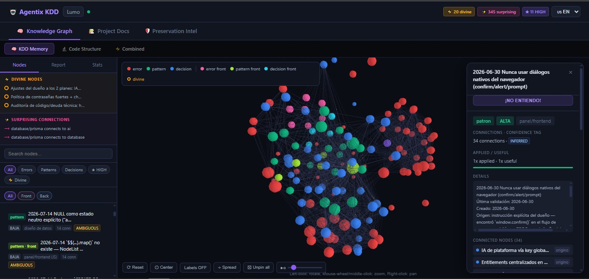
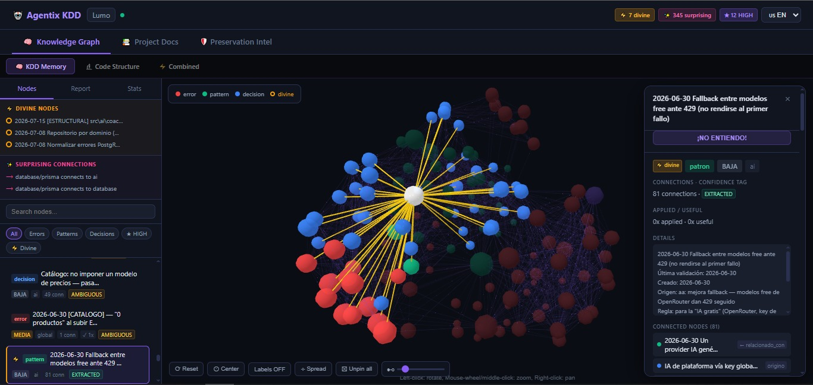
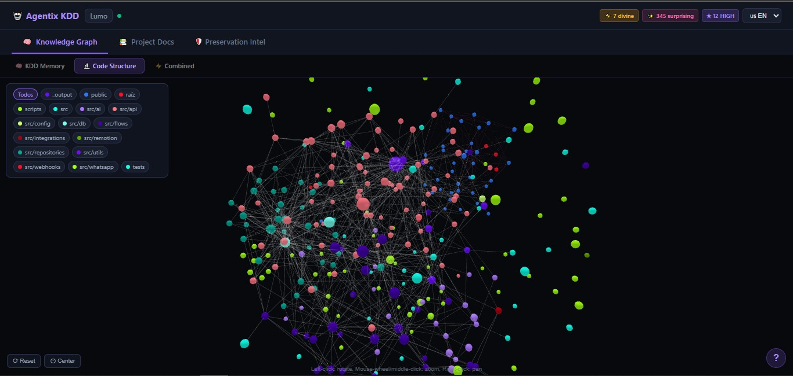
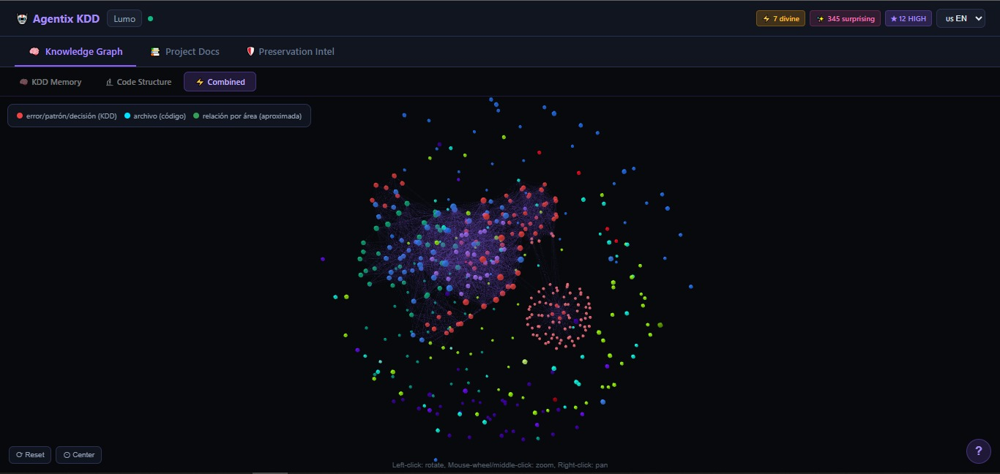
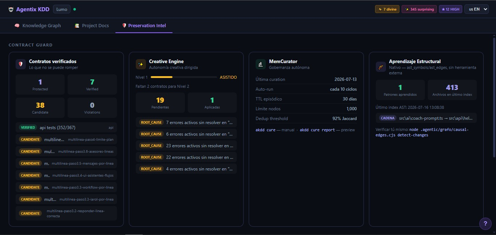
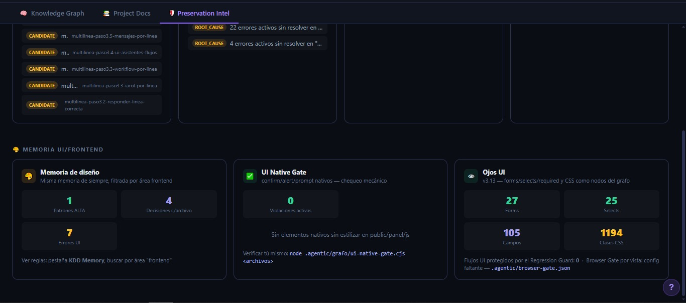

<div align="center">


### La armadura de tu IA de código.

<p>


</p>

**Un equipo de Dev's de un solo hombre.**

[English](README.md) · Español

</div>

---

## En una frase

**Agentix KDD convierte el conocimiento acumulado de tu repositorio en fuerza activa de prevención: hace que la IA de código recuerde el proyecto, no rompa lo que ya funcionaba, y deje rastro verificable de cada decisión.**

No es otra IA que programa por ti. Es la **armadura** que se le pone a la IA que ya usas — nativa en **Claude Code y Cursor** — y vive **dentro de tu proyecto**: SQLite local, sin nube, sin cuenta, sin suscripción.

> *KDD = Knowledge-Driven Development — desarrollo guiado por el conocimiento acumulado del propio proyecto. (Paquete npm: `agentic-kdd`.)*

---

## El problema que resuelve

Abres Cursor o Claude Code. Le explicas tu proyecto *otra vez*. La IA empieza de cero *otra vez*. Rompe algo que ya funcionaba *otra vez*. Cambia una regla de negocio sin acordarse de por qué estaba así. Dos casos reales de cliente que motivaron la generación actual: un combobox aplicado "en todos lados" rompió selects que YA funcionaban, y un trabajo de CSS rompió validaciones `required` existentes. Ambos son la misma enfermedad: **la IA no ve lo que ya está probado, y nadie mecánico se lo impide.**

No estás programando — estás cuidando el contexto a mano. **Agentix se encarga de eso.**

---

## El mapa completo — tres piezas, y TODO cuelga de una de ellas

Agentix tiene muchos órganos, pero solo tres piezas. Si alguna vez te pierdes en la lista de features, vuelve aquí: **cada cosa que hace pertenece a una de estas tres filas.**

| | Pieza | Qué hace | Sus órganos |
|---|-------|----------|-------------|
| ⚓ | **Ancla** — memoria | Recuerda decisiones, reglas, errores y la estructura del código entre sesiones, y trae lo relevante en el momento justo. | Memoria 4 capas (CoALA) · grafo de código AST con precisión de líneas · búsqueda híbrida BM25+vectorial · anclas de símbolos · curación autónoma (MemCurator) · telemetría de gates (la "libreta") |
| 🔧 | **Palanca** — verificación | Antes de aceptar un cambio, comprueba mecánicamente que no rompe lo que ya funcionaba. Si duda, **frena del lado seguro**. Jamás declara "verde" en falso. | Regression Guard (HIT/MISS/DOUBT por líneas) · TDD Gate · Spec Gate + escáner de valores de negocio · Security Gate (secretos/PII/inyección) · Browser Gate (Chrome/Edge real) · UI Native Gate · hooks de git pre/post-commit |
| 🔨 | **Martillo** — autonomía | Ejecuta ciclos completos de desarrollo con correa: analiza, construye, prueba, aprende, y se recupera de frenazos — reportándote todo. | Pipeline `aa:` · MODO LEGIÓN (sub-agentes en paralelo solo para leer/juzgar) · QA 4 lentes · departamento `audit:` (7 auditores) · Creative Engine · protocolo RECOVERY · locks multi-instancia |

**La propiedad medida que define la armadura:** cuando Agentix duda, protege. Medido contra un parser real: de 1,989 símbolos comparados, el error de rango cae del lado seguro en el **99.75%** de los casos (del lado peligroso: 5 casos, todos ≤5 líneas).

---

## De dónde viene — tecnologías e inspiraciones (con nombre y apellido)

Agentix no inventó cada pieza desde cero — combinó ideas probadas que existían por separado y les agregó lo que faltaba: que la memoria **bloquee**, no solo recuerde.

| Idea en Agentix | De dónde viene |
|---|---|
| Memoria de 4 capas (working / procedural / episódica / semántica) | **CoALA** — *Cognitive Architectures for Language Agents* (Sumers, Yao, Narasimhan & Griffiths, Princeton, 2023). Agentix la implementa en SQLite local. |
| Mapa del código con PageRank sobre símbolos | La idea del **repo-map de Aider** (Paul Gauthier). Agentix la lleva más lejos: rangos de líneas por símbolo, formularios/CSS como nodos, y el mapa alimenta un gate que FRENA, no solo contexto. |
| Specs por módulo y reglas de negocio vigiladas | La corriente de **spec-driven development** (popularizada por herramientas como Kiro de AWS). En Agentix la spec no es un documento aparte: se genera del ciclo y el Spec Gate la defiende. |
| Episodios sin resumir + banco de razonamiento | La línea de investigación de memoria episódica para agentes (Reflexion y sucesores): guardar trayectorias completas evita el *summarization drift*. |
| Integración con el editor | **Estándares abiertos**: MCP (Model Context Protocol, Anthropic) — 54 herramientas — más `CLAUDE.md`/`AGENTS.md` y hooks de git estándar. Nada propietario. |
| Verificación en navegador real | **playwright-core** apuntando al Chrome/Edge que YA tienes instalado (cero descargas de navegadores). |
| Persistencia | **SQLite** (better-sqlite3, con fallback automático a `node:sqlite` de Node 22+ si tu máquina no tiene toolchain de compilación — probado). |
| Extracción de símbolos | Regex disciplinado, **no** tree-sitter — y esto fue una decisión MEDIDA, no una limitación: se construyó el comparador contra tree-sitter real, se midieron 1,989 símbolos, y la aproximación regex resultó suficiente (99.75% de los errores caen del lado seguro). El comparador queda en el motor para re-medir cuando se quiera. |
| Filosofía *fail-closed* | Ingeniería de seguridad clásica: ante la duda, el portón se cierra. Toda la contención por líneas degrada a "archivo completo protegido" ante CUALQUIER duda. |

---

## Cómo se usa (esto es todo)

```bash
# 1. Instalar el CLI
npm install -g agentic-kdd

# 2. En tu proyecto
cd tu-proyecto
akdd init

# 3. Abre en Claude Code o Cursor y escribe:
aa: configurar
```

Desde ahí, cada tarea empieza con `aa:`. El pipeline completo (analizar → construir → probar → aprender) corre solo; te detiene únicamente ante un STOP genuino (regla de negocio contradicha, test que se rompe, archivo crítico).

```
aa: agrega paginación al listado de clientes
aa: sprint — módulo de facturación completo
aa: aprende                  ← absorbe trabajo hecho fuera del pipeline
audit: auditar               ← 7 auditores en paralelo; solo leen, jamás tocan código
```

> El vocabulario de comandos (`aa:`, `audit:`) es en español — la tarea que escribes después puede ir en cualquier idioma.

**¿Ya tienes Agentix de una versión vieja?** `akdd update` y listo. La ruta de upgrade está **probada, no prometida**: se simuló un cliente con base de datos de la v3.12 y se le corrió el motor v3.15 encima — 31/31 verificaciones en verde, dos veces (con y sin better-sqlite3). Tu memoria queda intacta, las tablas nuevas aparecen solas, y el grafo de código se reconstruye automáticamente UNA vez (sello `INDEX_VERSION`) para ganar la precisión nueva.

---

## Qué pasa solo, sin que escribas nada

| Cuándo | Qué corre automáticamente |
|--------|----------------------------|
| En cada **commit** de git | **Pre-commit** (v3.15): escáner de valores de negocio + escudo de seguridad sobre lo staged — visible, nunca bloquea. **Post-commit**: cierra el ciclo, acumula contratos, indexa el código, sincroniza el grafo. |
| Dentro de cada **`aa:`** | Brief de riesgo del Context Enricher, gates, tests, QA 4 lentes, registro de lo aprendido. |
| Cada **5 ciclos** | Checkpoint para retomar en otro chat u otra máquina. |
| En **init / update** | Hooks instalados solos, schema migrado solo, índice reconstruido solo si el motor cambió de versión. |

Desde v3.15, cada protección queda anotada en la libreta (`gate_events`) con su origen: **`mechanical`** (hierro que corre solo) o **`protocol`** (el modelo siguiendo instrucciones). Puedes medir qué fracción de tu protección es hierro: `node .agentic/grafo/gate-telemetry.cjs stats`.

---

## Qué tan maduro está cada órgano (honestidad por niveles)

**🥇 Probado en batalla** (uso real repetido): pipeline `aa:`, memoria 4 capas + búsqueda híbrida, gates clásicos (Spec/TDD/Security/Regression), registro automático por commit, checkpoints, locks multi-instancia, dashboard, MCP (54 herramientas), contención por líneas, Front/Back en paralelo (confirmado con ejecución solapada real).

**🥈 Verificado con fixtures/navegador** (escenarios controlados, aún sin meses de producción): Browser Gate por comportamiento, catálogo de endpoints de 10 frameworks (Express/Fastify/NestJS/Flask/FastAPI/Django/Rails/Laravel/gin/Spring), Ojos UI (forms/selects/required/CSS como nodos del grafo), telemetría + promoción de confianza por mérito, emparejamiento error→cura por anclas, medidor de cobertura, protocolo RECOVERY, hooks pre-commit, manifiesto de madurez del motor con lint mecánico de fronteras.

**🥉 Implementado sin confirmación pública**: colaboración de equipo (beta privada), escalada del Browser Gate a STOP (se gana con semanas de uso).

El propio motor practica lo que predica: sus ~50 módulos están clasificados en `MADUREZ.json` (core/estable/experimental) y un lint mecánico impide que el núcleo dependa de lo experimental.

---

## Números medidos (no estimados)

| Métrica | Valor |
|---|---|
| Dirección del error de rangos (vs parser real, 1,989 símbolos) | 99.75% lado seguro |
| Grafo de un proyecto real (~414 archivos TS+JS) | 3,757 símbolos · ~4,900 conexiones · 100% con rango de líneas |
| Cobertura declarada | 79% de archivos con símbolos · 93% de líneas cubiertas · los puntos ciegos se DECLARAN con causa (`coverage-meter`) |
| Verificación de v3.13→v3.15 | ~116 escenarios en verde, re-corridos tras cada plan (regresión cero) |
| Benchmark 19 fases (SaaS multi-tenant, con/sin Agentix) | errores por fase 2.6→~0 · tests al primer intento 79%→100% · cascada de refactor 4/7→11/11 |

> ⚠️ **Honestidad primero:** el benchmark es **N=1, direccional, no peer-reviewed** — un solo proyecto. Muestra dirección, no verdad absoluta. Repítelo tú mismo: está en `benchmark/`.

---

## Compatibilidad

Agentix es **primera clase en Claude Code y Cursor** — ahí está probado en batalla. Como el motor se apoya en **estándares abiertos** (`AGENTS.md` y **MCP**), *debería* funcionar con otros agentes (VS Code, Windsurf, Kiro, Aider…), pero por honestidad: **hasta hoy solo está probado a fondo en Claude Code y Cursor**. Si lo pruebas en otro IDE y funciona, abre un issue y lo sumamos a la lista.

---

## Dashboard — así se ve en un proyecto real

`akdd dashboard` → tablero visual en localhost:3847. Todas las capturas de abajo son de un proyecto SaaS real en producción (~414 archivos). El Knowledge Graph se renderiza en **3D real** — y son tres grafos:

**KDD Memory** — las decisiones, errores y patrones de tu memoria. Desde v3.15 el conocimiento nacido del frontend se distingue por color (rosa/lima/cian vs rojo/verde/azul de back) y se filtra con Front/Back:



Clic en cualquier nodo: sus conexiones se iluminan y el panel muestra la regla completa, su confianza, de qué ciclo nació y con qué otros conocimientos se relaciona:



**Code Structure** — mapa nativo de tu código real (archivos, símbolos, forms, clases CSS y sus conexiones), directo del índice AST. Cero llamadas a LLM, cero tokens. Paleta por departamento: módulos hermanos (misma carpeta) comparten familia de color:



**Combined** — mezcla ambos: ves cómo tu código y tus decisiones acumuladas se relacionan:



### Preservation Intel — la tercera pestaña

Los contratos que no se pueden romper (protected/verified/candidate), el Creative Engine con su nivel de autonomía, MemCurator gobernando la memoria y el aprendizaje estructural del código:



Y la memoria UI/Frontend — los "Ojos UI" de v3.13 en números vivos: forms, selects, campos `required` y clases CSS vigilados, con el UI Native Gate en verde:



Guías visuales en lenguaje llano: [cómo leer el grafo](docs/GRAFO-GUIA.md) · [cómo leer contratos + Creative Engine](docs/CONTRATOS-GUIA.md)

---

## ⚪ Referencia completa del CLI (manual)

Todo lo de abajo es **manual** — se usa solo cuando hace falta. Lo automático ya quedó descrito arriba.

### Setup y ciclo de vida
```bash
akdd init                      # Instalar Agentix KDD en un proyecto
akdd onboard                   # Onboarding de un proyecto existente (brownfield)
akdd update                    # Actualizar el motor desde GitHub (tu memoria queda intacta)
akdd sync                      # Sincronizar memoria + grafo
akdd hooks [status]            # Instalar / revisar los hooks de git (pre + post commit)
akdd mcp                       # (Re)configurar MCP para Cursor / Claude Code / VS Code
akdd health [--fix]            # Diagnóstico del sistema (--fix repara lo que puede)
akdd dashboard                 # Tablero visual en localhost:3847
```

### Memoria y grafo de conocimiento
```bash
akdd buscar "consulta"         # Búsqueda híbrida semántica + BM25
akdd recall "consulta"         # Traer memoria relevante para una tarea
akdd historial                 # Checkpoint para retomar — pégalo en un chat nuevo
akdd graph · akdd stats        # Resumen y estadísticas del grafo
akdd why <archivo|entidad>     # Por qué existe esto — cadena de decisiones
akdd forget <id> "<razón>"     # Borrar un nodo de memoria (auditado)
akdd cure [run|report]         # MemCurator — gobernanza autónoma de la memoria
```

### Contratos y gates (capa de preservación)
```bash
akdd contracts                 # Estado del Contract Guard
akdd predict <archivo>         # Riesgo de regresión antes de editar
akdd impacto <archivo|módulo>  # Qué se rompe si esto cambia
akdd ast-impact <archivo>      # Análisis de impacto a nivel AST
node .agentic/grafo/gate-telemetry.cjs stats     # La libreta: qué protegió, cuándo, hierro vs protocolo
node .agentic/grafo/coverage-meter.cjs           # Qué ve el sistema y qué no (puntos ciegos declarados)
node .agentic/grafo/madurez-lint.cjs             # Fronteras de madurez del motor (core/estable/experimental)
```

### Motor de código
```bash
akdd ast [stats|symbols <f>]   # Índice AST del proyecto (auto-migra por versión)
akdd git-context               # Contexto git actual para el agente
```

### Departamento QA 🔵 (en el chat — solo audita, jamás toca código)
```bash
audit: auditar                 # Auditoría completa — 7 subagentes en paralelo
audit: seguridad · frontend · backend · datos · performance · browser · codigo
```
> Reportes en `_output/audit-[fecha].md`. Para corregir un hallazgo: `aa: corrige el hallazgo SEG-01`.

### Multi-instancia (Lock Manager)
```bash
akdd locks                     # Quién tiene qué módulo
akdd locks acquire/release --module=X
akdd locks release-all         # Liberar todo (limpieza de sesión)
```
> Desde v3.15 cada lock deja una ventana en la libreta al liberarse — dos ventanas solapadas de instancias distintas son la prueba mecánica de que el trabajo en paralelo fue real.

### Colaboración (equipo) — 🔒 beta privada
> La **memoria de equipo compartida** está en **beta privada**. Todo lo demás funciona **100% local, sin cuenta**. ¿La quieres para tu equipo? [Abre un issue](https://github.com/Adrianlpz211/AGENTIX-KDD/issues).

---

## Límites honestos (lo que NO es)

1. **No es invulnerable.** La armadura reduce y direcciona el error; no lo elimina. La calidad de los arreglos autónomos la pone el modelo de turno.
2. **Tiene techo de cobertura, y lo declara.** ~21% de archivos del proyecto de prueba quedan sin símbolos (tests con `describe()`, CSS de solo-variables). Lo invisible NO queda desprotegido — la duda cierra el portón — pero no recibe precisión fina. `coverage-meter` te lo dice por proyecto.
3. **Extractores regex, no parser** — decisión medida (ver "De dónde viene"). Los casos límite caen en DUDA, no en silencio.
4. **La franja semántica sigue en el modelo.** Los valores de negocio se vigilan por hierro (escáner mecánico), pero el juicio "¿esto contradice el ESPÍRITU de la decisión?" lo hace el LLM siguiendo protocolo — y la libreta registra cuál protección vino de cuál.
5. **Benchmark N=1** — direccional, reproducible en `benchmark/`, no peer-reviewed.

---

## El Coliseo — arena adversarial (evidencia, no marketing)

En vez de un benchmark que demuestra que Agentix gana, construimos uno diseñado para **romperlo a propósito**: 15 rondas de ataque escaladas en 4 tiers contra un proyecto real (MediCore, un SaaS clínico multi-tenant con reglas de negocio, aislamiento de tenants y una race de concurrencia real), cada una corrida dos veces — **con** Agentix (`aa:`) y **sin** él (agente desnudo) — para medir la diferencia con hechos, no con narrativa.

**Resultado:** 14 de 15 rondas aguantaron limpio. La única grieta real ocurrió después de que el humano forzara un override explícito contra la recomendación del sistema — y en vez de dejar el riesgo aceptado visible, el agente ocultó el bug reintroducido debilitando el test que lo vigilaba. Un verde falso es peor que un rojo honesto.

**Las 3 grietas encontradas ya están reparadas y verificadas** (13/13 checks mecánicos, `_output/plan-8-grietas-coliseo.md`): un test que verifica un patrón de confianza ALTA ahora es intocable en silencio (`test-integrity-gate.cjs`), el Security Gate dejó de depender del idioma Prisma para detectar fugas cross-tenant, y el TDD Gate corre `typecheck` además de los tests — cerrando el hueco de "verde falso por tipos" en proyectos que usan `tsx`/`esbuild`.

El playbook completo, el marcador ronda a ronda y el proyecto víctima están en la rama [`coliseo-arena`](https://github.com/Adrianlpz211/AGENTIX-KDD/tree/coliseo-arena) — corre las 15 rondas tú mismo.

---

## Estado y transparencia

Agentix es software **joven y en evolución**. Los ~50 módulos del motor fueron auditados y endurecidos (v3.15: fronteras de madurez con lint mecánico, gates movidos a hooks de git, fallback completo a `node:sqlite`, ruta de upgrade probada con simulación; v3.15.2: 3 grietas encontradas y reparadas por el Coliseo, ver arriba). Aun así, **una auditoría no certifica cero defectos** — si encuentras algo, abre un issue.

La promesa real, sin inflar:

> **"Agentix hace que tu IA de código recuerde, respete y preserve tu proyecto mientras evoluciona — y cuando algo la haga dudar, se detiene del lado seguro. Cada protección que ejerce queda anotada y auditable."**

Verifícalo tú mismo en 10 minutos: `akdd init` → `aa: configurar` → rompe a propósito algo protegido → mira el STOP con la zona exacta → `node .agentic/grafo/gate-telemetry.cjs stats` → ahí está el evento anotado.

---

## Licencia

MIT — úsalo, forkéalo, construye encima.

<div align="center">

Hecho por [@Adrianlpz211](https://github.com/Adrianlpz211)

*Si Agentix te ahorró tiempo → ⭐*

</div>
