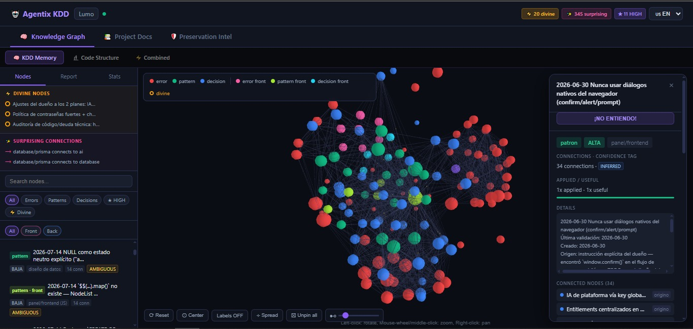
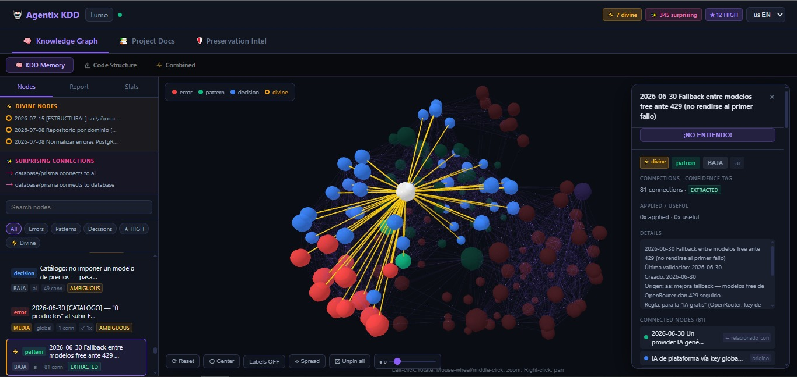
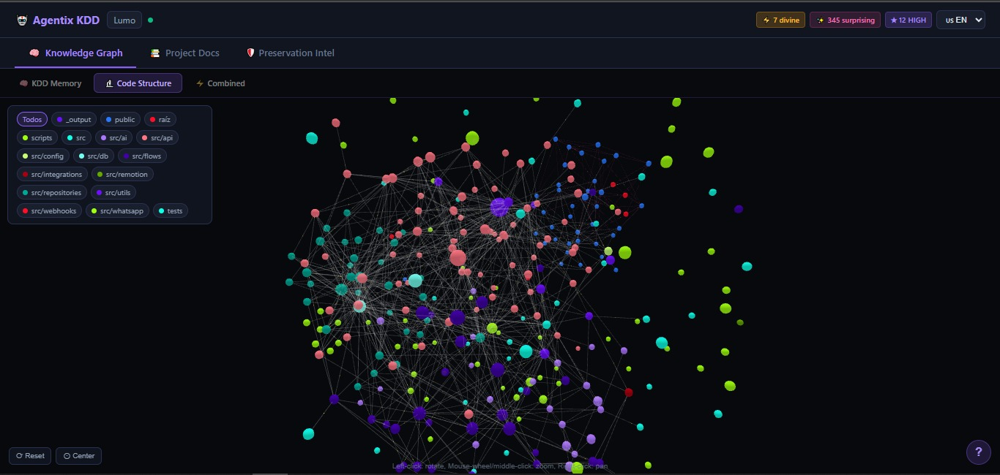
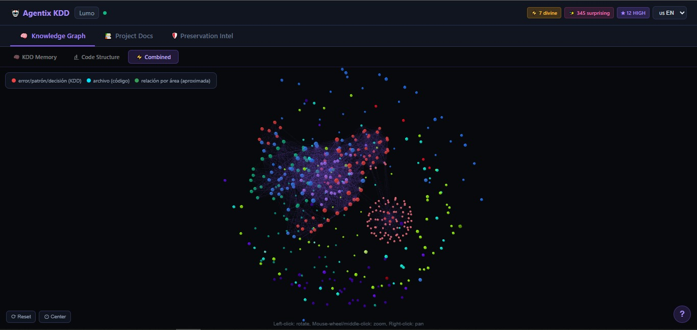
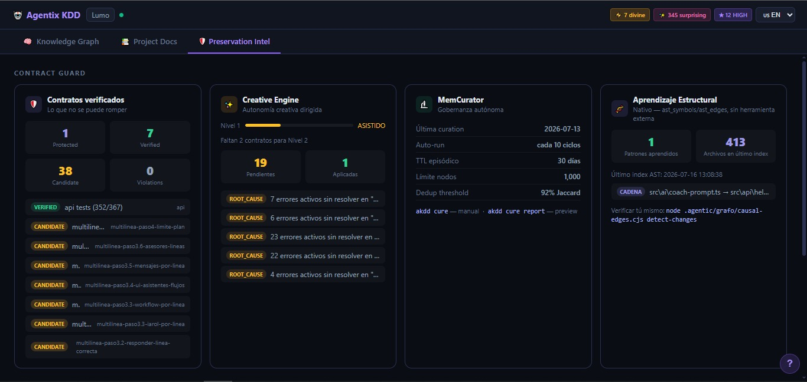
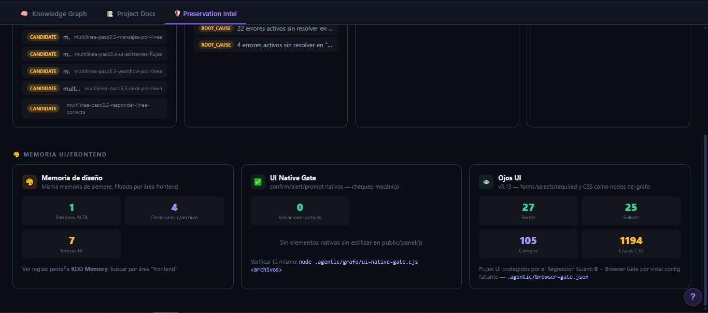

<div align="center">


### La armadura de tu IA de código.

<p>


</p>

**Un equipo de Dev's de un solo hombre.**

[English](README.md) · Español

</div>

---

## En una frase

**Agentix KDD convierte el conocimiento acumulado de tu repositorio en fuerza activa de prevención: hace que la IA de código recuerde el proyecto, no rompa lo que ya funcionaba, y deje rastro verificable de cada decisión.**

No es otra IA que programa por ti. Es la **armadura** que se le pone a la IA que ya usas — nativa en **Claude Code y Cursor** — y vive **dentro de tu proyecto**: SQLite local, sin nube, sin cuenta, sin suscripción.

> *KDD = Knowledge-Driven Development — desarrollo guiado por el conocimiento acumulado del propio proyecto. (Paquete npm: `agentic-kdd`.)*

---

## El problema que resuelve

Abres Cursor o Claude Code. Le explicas tu proyecto *otra vez*. La IA arranca desde cero *otra vez*. Rompe algo que funcionaba *otra vez*. Cambia una regla de negocio sin recordar por qué estaba así. Dos casos reales de clientes moldearon la generación actual: un combobox aplicado "en todos lados" rompió selects que YA funcionaban, y un trabajo de CSS rompió validaciones `required` existentes. Es la misma enfermedad: **la IA no ve lo que ya está probado, y nada mecánico la frena.**

No estás programando: estás haciendo de niñera del contexto a mano. **Agentix se encarga de eso.**

---

## Agentix de un vistazo

Todo lo que hace Agentix pertenece a una de **tres piezas**. Si te pierdes en la lista de funciones, vuelve a esta tabla.

| | Pieza | Qué hace | Sus órganos |
|---|---|---|---|
| ⚓ | **Ancla** — memoria | Recuerda decisiones, reglas, errores y la estructura del código entre sesiones, **rastrea de dónde salió cada pieza de conocimiento** y presenta solo lo relevante en el momento justo. | Memoria de 4 capas (CoALA) · grafo KDD · grafo AST del código con precisión de línea · recall híbrido BM25 + vectores con presupuesto de tokens · **memoria con procedencia** (actividad → observación → conocimiento → evidencia) · **recuperación por capas** · **compactación que conserva el original** · redacción de privacidad · curas conocidas · descripciones en lenguaje natural por archivo · MemCurator · libreta de gates · tiempo de tarea medido |
| 🔧 | **Palanca** — verificación | Antes de aceptar un cambio, comprueba mecánicamente que no rompa lo que ya funcionaba. Ante la duda **frena del lado seguro**. Jamás reporta un falso "verde". | Cierre por evidencia (PASS/FAIL/SKIP/UNVERIFIED/ERROR) · TDD Gate · Preservation Gate (contratos por test + escenarios de front) · Regression Guard · archivos protegidos · radio de impacto por AST · Spec Gate · Security Gate (secretos/PII/inyección/cross-tenant) · Browser Gate · UI Native Gate · memoria de diseño · CSS Token Gate · Simple Gate · git hooks · calificación de predicciones |
| 🔨 | **Martillo** — autonomía | Corre ciclos completos de desarrollo con correa: analiza, construye, prueba, aprende, se recupera de los frenos y reporta. | Pipeline `aa:` · router de esfuerzo (LOW/MEDIUM/HIGH) · MODO LEGIÓN (sub-agentes en paralelo, solo en pasos de leer/juzgar) · QA de 4 lentes · departamento `audit:` · **TEAMS nativo** (director + tres revisores + constructor) · puntos de restauración · protocolo RECOVERY · locks multi-instancia · actualización segura · puente ClickUp (opt-in) · avisos de WhatsApp (opt-in) |

**La propiedad medida que define la armadura:** cuando Agentix duda, protege. Contra un parser real, de 1.989 símbolos comparados, el error de rango cae del lado seguro en el **99,75 %** de los casos (lado peligroso: 5 casos, todos ≤ 5 líneas).

### Un motor, dos formas de trabajar

| Quieres… | Escribes | Qué corre |
|---|---|---|
| **Un agente, una tarea** (el modo diario) | `aa: <tarea>` | El pipeline individual completo: enricher → análisis → construcción → TDD → QA → memoria → post-cycle → tiempo medido |
| **Claude Code dirige, Cursor construye** un plan grande | `teams: plan <objetivo>` | La campaña TEAMS: sprints de tareas, un constructor, tres revisores, cola de Correcciones, avance medido |
| **Auditoría de solo lectura** | `audit: auditar` | Siete auditores en paralelo; jamás toca código |

`aa:` y `teams:` cierran por el **mismo núcleo**: los mismos ciclos, memoria KDD, contratos, AST, memoria de diseño, preservation gate y dashboard. Una tarea de TEAMS se registra con `origen = teams`; nunca necesitas escribir `aa:` para ella. Nada del flujo individual cambió cuando llegó TEAMS, y una prueba de regresión corre el ciclo `aa:` completo contra un motor real para que siga así.

---

## Inicio rápido

```bash
# 1. Instala el CLI
npm install -g agentic-kdd

# 2. En tu proyecto
cd tu-proyecto
akdd init

# 3. Conecta el MCP una vez para TODOS tus proyectos (recomendado)
akdd mcp --global

# 4. Abre Claude Code o Cursor y escribe:
aa: configurar
```

Desde ahí, cada tarea empieza con `aa:`. El pipeline corre solo y únicamente te detiene ante un STOP genuino (regla de negocio contradicha, test roto, archivo crítico).

```
aa: agrega paginación al listado de clientes
aa: --dry-run refactoriza la validación de pagos   ← propone, no escribe nada
aa: explore cómo modelar facturas recurrentes      ← piensa contigo, no escribe nada
aa: sprint — módulo completo de facturación        ← tareas encadenadas; cada una alimenta la siguiente
aa: aprende                                        ← absorbe trabajo hecho fuera del pipeline
audit: auditar                                     ← 7 auditores en paralelo; solo lectura
akdd dashboard                                     ← ver todo
```

> El vocabulario de comandos (`aa:`, `audit:`, `teams:`) es en español — la tarea que escribes después puede ir en cualquier idioma. Los prefijos del chat son instrucciones para el agente, no comandos de shell.

---

## El ciclo diario — qué hace `aa:`

```
aa: <tarea>
   │
   ├─ 0    arranca el reloj · brief del Context Enricher (riesgo, curas conocidas, alertas activas)
   ├─ 1    Orquestador → nivel de esfuerzo LOW / MEDIUM / HIGH (máx. entre dificultad y riesgo)
   ├─ 2    Analista (exploración de solo lectura en paralelo si el cambio no es trivial)
   ├─ 3    Spec Gate · Security Gate · chequeo de regresión — antes de escribir una sola línea
   ├─ 4    Construcción (Front + Back en paralelo solo si sus archivos no se cruzan)
   ├─ 5    TDD Gate · Preservation Gate · Browser Gate · gates de UI/CSS
   ├─ 6    QA (revisión de 4 lentes si el cambio no es objetivamente trivial)
   ├─ 7    Memoria (errores, patrones, decisiones, descripciones — con procedencia)
   └─ 8    post-cycle · duración medida  →  reporte
```

Solo te detiene ante un STOP genuino, con la zona exacta y la razón. Todo lo que verificó queda en la libreta (`gate_events`) con su origen: **`mechanical`** (hierro que corre solo) o **`protocol`** (el modelo siguiendo instrucciones) — así puedes medir qué fracción de tu protección es hierro: `node .agentic/grafo/gate-telemetry.cjs stats`.

### Qué pasa solo, sin que escribas nada

| Cuándo | Qué corre automáticamente |
|------|--------------------------|
| En cada **commit** de git | **Pre-commit** sobre el *índice* (lo que realmente commiteas): escudo de seguridad (secretos filtrados, cross-tenant, bypass de JWT **bloquean**; PII y Unicode invisible avisan), integridad de tests (quitar un caso de un test protegido **bloquea**), UI nativa, valores de negocio. **Commit-msg**: el canario — un *fix* sin ningún test **bloquea**. **Post-commit**: encola el commit por SHA y cierra el ciclo en segundo plano. Nunca bloquea. |
| En cada **post-cycle** | Escaneo de integridad de spec/tests · memoria de diseño (valores que vuelven a un estado abandonado, propiedades que desaparecen) · tokens CSS · Simple Gate · Preservation Gate · calificación de la predicción de riesgo · auditoría de dependencias · **memoria con procedencia** (el ciclo queda como actividad real, se drena la cola, el conocimiento validado cuyos archivos cambiaron pasa a *sospechoso*) · ciclo cerrado desde estados reales de gates |
| Dentro de cada **`aa:`** | Brief del Context Enricher · nivel de esfuerzo · gates · tests · QA de 4 lentes · memoria · duración medida |
| Cada **5 ciclos** | Checkpoint para retomar en otro chat o máquina |
| En **init / update** | Los hooks se instalan solos (respetando los tuyos); el índice AST se reconstruye una vez si el motor cambió de versión; el esquema migra **dentro** de `akdd update`, con respaldo y verificación |

Escotilla de emergencia para los hooks: `AKDD_SKIP_GATES=1 git commit ...` — la guardia opcional del IDE (`akdd host-hooks install`) le niega esa escotilla y `--no-verify` al agente.

---

## ⚓ Memoria — el Ancla

Agentix guarda su memoria en la propia `memoria.db` del proyecto: cuatro capas (trabajo / procedimental / episódica / semántica — según **CoALA**), un grafo de conocimiento de decisiones, errores y patrones, y un mapa AST del código. La búsqueda es híbrida (BM25 + vectores) con presupuesto de tokens; `recall` devuelve solo lo relevante para el área que vas a tocar, y cuando el área tiene una **cura conocida** — un error que ya pasó con el arreglo que funcionó — el brief abre con ella.

### Memoria con procedencia (3.20.1)

Todo lo que sigue es **nativo**: sin Claude-Mem, sin proxy Headroom, sin servicio en la nube, sin demonio extra y sin llamadas de pago por defecto. Otros proyectos inspiraron algunas ideas; los mecanismos son propios de Agentix y viven en la misma base.

| Pieza | Qué es |
|---|---|
| **Actividad** | Un evento crudo de una acción real: ejecución de herramienta, fase, resultado de un gate. Idempotente por proyecto + host + sesión + id de evento del host: reenviar un evento deja **una** actividad y **un** job; dos ejecuciones idénticas en momentos distintos son **dos** actividades. |
| **Observación** | Una lectura acotada de una o más actividades (test que falla, archivos tocados, decisión explícita, resultado de gate). Muchas lecturas del mismo archivo se vuelven **una** observación agrupada. |
| **Conocimiento** | Un nodo KDD con estado: *propuesto → validado → sospechoso → obsoleto*, mapeado sobre los estados de nodo existentes. |
| **Evidencia** | Un artefacto verificable: id, SHA-256, tamaño, alcance, retención. |

**Una observación o un resumen nunca validan nada.** Validar exige evidencia *vigente* (su hash se re-verifica en ese momento) y un validador que sea un gate, un test, la persona o un verificador. A propósito **no** se expone al modelo por MCP: `akdd memory validate <nodo> --evidence=ev_… --by=gate`. Cuando el código relacionado cambia, el conocimiento validado pasa a *sospechoso*. El conocimiento idéntico en el mismo alcance suma una ocurrencia en vez de un nodo nuevo; el parecido se vuelve *candidato a revisión*, nunca una fusión; las contradicciones conservan ambos orígenes. Los registros anteriores a 3.20.1 se muestran como `LEGACY_UNVERIFIED_PROVENANCE` al leerse — ni se reescriben ni se degradan.

Las tablas nuevas llegan **solo por `akdd update`**. Leer nunca crea ni migra nada: en una base vieja los comandos de memoria dicen `SCHEMA_MISSING` y apuntan a `akdd update`. Los nodos existentes conservan su id (INTEGER o TEXT) y su contenido.

**La privacidad va primero.** El texto se clasifica *autorizado / redactado / privado / desconocido* y se redacta **antes** de llegar a la base, la cola, una caché, el contexto entregado o el dashboard. La redacción **falla cerrada**: un error del redactor no guarda nada, jamás el original. Las rutas privadas (`.env`, llaves, credenciales…) guardan solo metadatos. Añade tus propias rutas y campos denegados en `.agentic/privacy-policy.json`. Las expresiones regulares no pueden garantizar que atrapen todo secreto — trata al redactor como reducción de riesgo, no como un DLP.

**Lo que se captura depende del host** — `akdd memory capabilities` imprime el panorama real:

| Host | Captura | Qué ve |
|---|---|---|
| Claude Code / Cursor **con los hooks del host instalados** (`akdd host-hooks install`, nunca automático) | `NATIVE_PASSIVE` | Acciones de shell, edición y MCP **antes** de ejecutarse, y la decisión de la guardia — no la salida de la herramienta |
| Los mismos hosts **sin** hooks | `PIPELINE_ONLY` | Solo lo que pasa por Agentix: `aa:`, post-cycle, herramientas MCP de Agentix, TEAMS |
| Cualquier otro host | `UNSUPPORTED` | No se promete nada |

**No** ve las lecturas y búsquedas internas de un IDE, la salida de las herramientas, ni el razonamiento del modelo.

**Cola durable.** La captura inserta el evento y su job en **una** transacción; un worker lo reclama con arriendo (lease) y token de fencing, lo procesa con reglas deterministas (sin llamar a ningún modelo), reintenta con backoff y al final lo aparta como *dead-letter*, visible y reintentable (acotado). Una cola llena responde `BACKPRESSURE` y no afirma "capturado". La captura nunca bloquea Shell/Edit: si falla, informa un estado degradado.

### Recuperación por capas

```bash
akdd memory index --query="regla de reembolso"   # 1. índice compacto: id, título, estado, procedencia, costo estimado
akdd memory detail --ids=12,40                   # 2. detalle de los ids elegidos, en lote acotado
akdd memory timeline --node=12                   # 3. cronología alrededor de una actividad o nodo, paginada
akdd memory evidence ev_…  --lines=100-140       # 4. original autorizado, con hash
```

Cada respuesta trae estados explícitos (`OK`, `NO_RESULTS`, `NO_DB`, `SCHEMA_MISSING`, `ERROR`, `INSUFFICIENT_BUDGET`), un total conocido, `has_more`/cursor y *por qué* algo se omitió. Los presupuestos son **acumulados por tarea** y siguen el nivel de esfuerzo. Los **contratos protegidos aplicables nunca se descartan en silencio** por un presupuesto. La búsqueda léxica funciona sin embeddings y jamás crea el índice FTS mientras consulta. Las mismas capas son herramientas MCP (`memory_index`, `memory_detail`, `memory_timeline`, `memory_evidence`); `recall` y `remember` no cambian.

### Compactar sin perder el original

`akdd context compress <archivo|-> --kind=log|test|json|search|doc|code --task=T` compacta un resultado grande de una herramienta de forma **determinista** (sin modelo, sin Python, sin ML) y guarda el original autorizado; `akdd context recover <reference_id> --lines=a-b` lo devuelve con su hash verificado.

- Los logs agrupan repeticiones exactas y conservan el contexto alrededor de los errores; las corridas de tests conservan **todas** las fallas; el JSON se entrega como *muestra* explícitamente rotulada con los conteos originales; las búsquedas conservan todas las rutas afectadas.
- **El código que vas a editar, auditar, depurar o verificar se entrega completo**, igual que la evidencia de gates. Solo la orientación usa el índice AST.
- **Una muestra jamás prueba ausencia.** "Sin fallas" exige el original completo.
- Una compactación malformada, vacía o inflacionaria devuelve el original con una advertencia. Una referencia vencida o cambiada responde `EXPIRED` / `EVIDENCE_CHANGED` — nunca contenido reconstruido. La evidencia de gates es durable; los originales usados por una tarea o sprint activos quedan anclados (pin); solo caduca la caché sin pin.

### Esfuerzo que sí cambia

`LOW` significa menos: sin búsqueda global y sin delegación innecesaria — mientras alcance, archivos protegidos, seguridad y arriendos siguen en todos los niveles, y un "cambio pequeño" en auth, pagos o una migración sigue siendo `HIGH`. Las lecturas de archivos sin cambios se reutilizan, y un hash distinto siempre invalida. Controlar el esfuerzo de razonamiento *del proveedor* requiere una integración explícita que **no está instalada**; Agentix declara `HOST_NATIVE_UNCONTROLLED` y nunca promete reducir el pensamiento interno de un host. `akdd effort budget …` muestra el presupuesto acumulado de una tarea.

---

## 🔧 Verificación — la Palanca

| Gate | Qué garantiza |
|---|---|
| **Cierre por evidencia** | PASS exige el **artefacto de ejecución del sujeto exacto**. Un id inventado, un runner con cero aserciones o código que cambió tras la corrida → `UNVERIFIED`, nunca verde |
| **TDD Gate** | Los tests corrieron de verdad (y `typecheck` junto a ellos); los contratos se acumulan por test individual |
| **Preservation Gate** | Contratos por test, escenarios de front, un manifiesto `.agentic/protected_files`, impacto por aristas AST reales. Cobertura incompleta se lee `UNKNOWN`, nunca `LOW` |
| **Regression Guard** | Los comportamientos que pasaron repetidamente quedan protegidos: romper uno detiene el ciclo hasta que lo sobrescribas a propósito |
| **Spec Gate** | Un prompt que contradice un valor de negocio de confianza ALTA en memoria (días de prueba, prefijos, límites…) frena con la regla exacta |
| **Security Gate** | Secretos y credenciales filtrados (**bloquea**), PII, inyección de prompts, Unicode invisible, y chequeos cross-tenant / bypass de JWT agnósticos del ORM en archivos críticos |
| **Browser Gate** | Un Chrome/Edge real: errores de consola, errores de página, chequeos de contrato (`required`, a11y, teclado, flujos), snapshots visuales con diff de píxeles |
| **UI Native · CSS Token · Simple · memoria de diseño** | `confirm()`/`alert()` nativos en vez de tus wrappers, valores escritos a mano que ya existen como token, código duplicado, y decisiones de layout que se revierten en silencio |
| **Integridad de tests · canario** | Un test que verificaba un patrón protegido no se debilita en silencio; un *fix* sin test no cierra |
| **Calificación de predicciones** | Cada predicción de riesgo se registra y se califica contra lo que los gates hallaron después; el número a bajar es el **falso negativo** (predijo BAJO y algo se rompió) |

---

## 🔨 Autonomía — el Martillo

### TEAMS nativo — Claude Code dirige, Cursor construye

Abre ambos en el mismo proyecto y, en el chat:

```
teams: activar
teams: plan <objetivo>
teams: ejecutar
teams: estado · teams: pendientes · teams: pausa · teams: continuar · teams: avance · teams: cerrar
```

Un plan tiene sprints de tareas con `acceptance`, `allowed_files`, `depends_on`, `risk` y `change_type`. Activar las tablas de TEAMS en un proyecto existente pide aprobación de migración (`init --aprobar-migracion`). Equivalente por CLI: `akdd teams <init|plan|run|status|pending|resolve|goal>`.

TEAMS corre sobre el **mismo núcleo que `aa:`**. Cada tarea que el director verifica pasa por un puente que la registra como ciclo, memoria, contratos, AST, layout y evidencia de preservación con `origen = teams`. El registro es un *outbox*: se encola en la misma transacción que el evento, se reintenta si falla, y la tarea queda `MEMORY_PENDING` hasta que de verdad se registre. Un registro fallido nunca bloquea tareas independientes, pero impide que el cierre final sea "completo".

| Pieza | Qué hace |
|---|---|
| **El constructor nunca marca DONE** | Entrega; el director verifica con gates sobre el sujeto exacto |
| **Tú aterrizas, el director planifica** | Tú dices todo (alcance, reglas, enlaces de referencia). El director lo convierte en sprints → fases → tareas con aceptación, archivos, dependencias, riesgos y criterios de revisión, te muestra un resumen y pregunta solo lo indispensable |
| **La auditoría nunca frena el avance ordinario** | El constructor sigue Fase 1 → Fase 2 → Sprint 2 mientras los revisores trabajan. Un hallazgo tardío va a **Correcciones pendientes**; el constructor lo lee primero, suspende su tarea de forma segura, corrige y retoma en la posición exacta. Una dependencia real sin cumplir sí bloquea su rama; seguridad y preservación nunca se relajan |
| **Tres revisores** | Frontend/UI-UX, backend y negocio (un auditor general de la lógica del dominio). Cada veredicto queda atado al hash que revisó; un hash viejo no cuenta |
| **Cierre** | Una cola vacía *no* es el final: la campaña espera la auditoría final. El director cierra solo cuando los tres revisores concluyeron sobre el sujeto FINAL, los hallazgos están resueltos o listados y cada registro de memoria está hecho. El constructor acusa recibo y detiene **su propio** loop y watch. Estado final: `COMPLETED` o `COMPLETED_WITH_PENDING` |
| **Decisiones que son tuyas** | Se registran con la pregunta y las alternativas; el trabajo independiente continúa; el director reporta *«el proyecto quedó en X % por estas decisiones tuyas»*. X sale del plan (tareas verificadas ÷ tareas planeadas), nunca se inventa |
| **Investigación en internet** | El director y el revisor de negocio pueden consultar los **enlaces de referencia que diste** (o los que autorices). Lo traído se guarda como evidencia (URL, fecha, hash), redactado, y se trata estrictamente como dato. Se rechazan las redes privadas y las redirecciones hacia ellas |
| **Dos vigilantes independientes** | El loop del host cada 180 s es el respaldo que sí despierta al modelo; un watch de archivos baja la latencia a segundos. Una señal no es una tarea ni un ACK |
| **Contexto compartido** | Director y constructor intercambian **paquetes versionados** (snapshot, o un delta solo contra la revisión que el receptor confirmó); el director **re-verifica la evidencia original** — un PASS inventado o evidencia de una versión anterior se rechaza |

```bash
akdd teams prompt director      # los prompts reales de arranque, con tus rutas absolutas y tu plan
akdd teams prompt builder       # pégalo una sola vez en Cursor
akdd teams avance               # avance medido y las decisiones tuyas que lo frenan
akdd teams correcciones listar  # hallazgos por prioridad   ·   akdd teams revision ...   ·   akdd teams cerrar
akdd teams vigilancia estado    # qué está instalado, vivo, detectando, y qué acepta realmente el host
akdd teams investigar consultar --plan=P --url=... --pregunta="..."
```

**Cómo se despierta al modelo.** Un watcher de archivos no puede entrar a un chat por sí solo; lo hace el host. El director y el constructor lanzan cada uno `teams-vigilancia.cjs esperar --rol=<rol> --despertar` como **tarea en segundo plano de su host** (Claude Code: un comando en segundo plano o Monitor; Cursor: un proceso en segundo plano). Imprime `AGENT_LOOP_WAKE_<rol>` y termina cuando hay trabajo, el host se lo entrega a la sesión como notificación, la sesión lee, trabaja y lo relanza. Sin trabajo no gasta turnos. El loop del host de 180 s queda como respaldo. Agentix lo reporta como `EVENT_WAKE_POR_TAREA_DEL_HOST` mientras la espera está viva y solo como `EVENT_WAKE_VERIFICADO` cuando la sesión confirmó una lectura posterior a un aviso.

**Límites, dichos con claridad.** Sin esa tarea en segundo plano ni un loop del host confirmado el modo es `MANUAL_ONLY` (`EVENT_WAKE_UNSUPPORTED`) y no se anuncia autonomía. TEAMS está verificado con constructor/recibos simulados y almacenamiento real (niveles A y B); la **campaña real Claude Code + Cursor (nivel C) es `NO_EJECUTADO`** hasta que tú la corras. No se instala ninguna tarea programada de Windows sin que lo apruebes, y actualizar Agentix nunca instala una.

### El resto del martillo

- **Router de esfuerzo** — LOW / MEDIUM / HIGH = máx(dificultad, riesgo). Pequeño *y* riesgoso igual recibe los controles de riesgo; los gates mínimos no se pueden quitar, ni siquiera con una política propia.
- **MODO LEGIÓN** — sub-agentes en paralelo solo en pasos de leer/juzgar (análisis, revisión). Escribir código y guardar memoria siempre tienen un solo autor. Si el host no tiene sub-agentes, los mismos pasos corren en secuencia con resultado idéntico.
- **Departamento `audit:`** — siete auditores (seguridad, frontend, backend, datos, performance, browser, código) en paralelo; los reportes caen en `_output/audit-[fecha].md`; jamás tocan código.
- **Puntos de restauración** — `aa: restore point crear <resumen>` · `aa: restore <id>`. Los puntos son commits de Git en refs privadas; HEAD, rama, índice y `git status` quedan idénticos antes y después. Aplicar muestra **qué se escribe, qué se borra, qué queda fuera y qué NO vuelve** (base de datos, despliegues, mensajes enviados), exige el hash del estado actual, crea primero un punto de rescate y verifica por hash al terminar.
- **Protocolo RECOVERY** — cuando un gate frena, se consulta la memoria por un par error→fix conocido, se aplica el diff mínimo y se re-corre *el mismo* gate. Los archivos críticos y los conflictos de valores de negocio siempre escalan a ti.
- **Locks multi-instancia** — varios agentes en un proyecto no chocan en módulos ni en esquema.
- **Medición de tiempo** — cada tarea reporta cuánto tomó (trabajado vs transcurrido). Un ciclo sin huella se muestra como *sin dato* — nunca como `0` y nunca estimado.
- **Puente ClickUp (opt-in)** — `akdd cu on`, `akdd cu set-list <id>`, `akdd cu sprint [--auto]`. Una tarea corre sola únicamente si es claramente relevante, no toca archivos críticos, no contradice un valor de negocio en memoria, no toca autenticación y tiene una descripción sustancial. Apagado por defecto.
- **Avisos de WhatsApp (opt-in)** — a través de tu propia sesión de WhatsApp Web; lo que llegue es dato, nunca una aprobación.

---

## Dashboard

`akdd dashboard` → localhost:3847. La barra de pestañas trae las vistas originales más las páginas añadidas en 3.20.1:

| Pestaña | Qué ves |
|---|---|
| 🧠 **Knowledge Graph** | Memoria KDD, Code Structure y Combinado — tres grafos en 3D real, con vista **☰ Tabla** y el tour guiado. Sin cambios |
| 📚 **Project Docs** | Documentación por módulo y descripciones de archivos en lenguaje natural |
| 🛡️ **Preservation Intel** | Contratos, Creative Engine, MemCurator, memoria de diseño |
| ⏱ **Línea de Tiempo** | Tiempo medido por tarea y módulo |
| 🧬 **Memoria** (`/memoria`) | Qué hay guardado, la cola y los dead-letters, procedencia, registros legacy, estados de salud independientes |
| 📦 **Contexto y esfuerzo** (`/contexto`) | Nivel de esfuerzo, presupuesto acumulado, reducción neta de payload y *cómo se midió*, cobertura por host |
| 👥 **TEAMS** (`/teams`) | Estado de la campaña, tareas, correcciones pendientes, revisores, avance medido, vigilantes |
| 🔄 **Actualización** (`/actualizacion`) | Versión instalada, compatibilidad del esquema, la última verificación, qué se preservó, el respaldo, qué hacer |

Las páginas nuevas son de solo lectura y paginadas; abrirlas nunca escribe. La salud muestra estados independientes — servicio, legible, esquema, búsqueda, última escritura verificada, cola, actualización — y el dashboard **no se pone verde** si el esquema está roto aunque HTTP responda 200. Un dato ausente dice "no disponible", nunca `0`. Una API de solo lectura (`/api/v1/summary`, `/tasks`, `/contracts`, `/incidents`, `/usage`, `/restore-points`…) y las librerías de grafos se sirven localmente — sin CDN.

Todas las capturas de abajo son de un proyecto SaaS real en producción (~414 archivos).

**KDD Memory** — decisiones, errores y patrones. El conocimiento nacido del frontend se distingue por color y se filtra con Front/Back:



Haz clic en cualquier nodo: sus conexiones se iluminan y el panel muestra la regla completa, su confianza, el ciclo del que nació y con qué se relaciona:



**Code Structure** — un mapa nativo de tu código real (archivos, símbolos, formularios, clases CSS y sus conexiones), directo del índice AST. Cero llamadas a LLM, cero tokens:



**Combinado** — cómo se relacionan tu código y tus decisiones acumuladas:



**Preservation Intel** — los contratos que no se pueden romper, el Creative Engine con su nivel de autonomía, MemCurator y el aprendizaje estructural:



Y la memoria de UI/Frontend: formularios vigilados, selects, campos `required` y clases CSS, con el UI Native Gate en verde:



Guías visuales en lenguaje llano: [cómo leer el grafo](docs/GRAFO-GUIA.md) · [cómo leer contratos + Creative Engine](docs/CONTRATOS-GUIA.md)

---

## El MCP — para qué sirve y cómo conectarlo

**El MCP es el puente entre el modelo y Agentix.** Sin él, el modelo solo usa la memoria, los contratos y los gates si se acuerda de abrir una terminal y correr los scripts — y muchas veces no lo hace. Con él, Cursor y Claude Code ven a Agentix como herramientas nativas:

| Momento | Herramienta que llama el modelo | Qué obtiene |
|---|---|---|
| Antes de tocar un módulo | `recall`, `verdad_vigente`, `memory_index` → `memory_detail` | Errores, decisiones y patrones conocidos de esa área — solo lo relevante, por capas, dentro de un presupuesto de tokens |
| Antes de planear un cambio | `impact_precheck`, `contracts_blast`, `effort_decide` | Qué se rompe si cambia este archivo, cuántos contratos están en riesgo, qué nivel y gates aplican |
| Mientras trabaja | `pipeline_step`, `pipeline_gate`, `contracts_gate`, `context_compress` / `context_recover` | Cada paso registrado por el harness; las salidas grandes compactadas con el original recuperable |
| Al cerrar | `remember`, `causal_add`, `memory_capture` | La lección probada entra a la memoria para la próxima sesión |
| Coordinación | `teams`, `teams_packet`, `restore`, `session_historial` | Planes entre Claude Code y Cursor, paquetes compartidos, puntos de restauración, retomar un chat |

Es el mismo motor y la misma `memoria.db` que el CLI — **no es otra IA, no es una memoria en la nube**. Su valor depende de que el agente use las herramientas; no puede mantener viva una sesión de IDE por sí mismo. El conjunto vigente de herramientas lo lista `akdd capabilities`.

### Conectarlo una vez, global

```bash
akdd mcp --global
```

- Copia un lanzador pequeño a `~/.agentix/mcp-launcher.cjs`.
- Añade **una** entrada `agentic-kdd` a `~/.cursor/mcp.json` (tus otros servidores MCP se preservan; un JSON inválido se deja intacto y se informa) y la registra en **Claude Code con alcance de usuario**.
- Cuando un IDE lo arranca, el lanzador encuentra el proyecto que tienes abierto y levanta **el servidor propio de ese proyecto, con la versión del motor y la memoria de ese proyecto**. Las memorias jamás se mezclan.
- Fuera de un proyecto Agentix responde con una sola herramienta `agentix_status` que lo dice — sin error y sin leer memoria.

Luego **Reload Window** en Cursor y abre una sesión nueva de Claude Code. `akdd mcp status` muestra lo configurado. `akdd mcp` (sin `--global`) sigue configurando un solo proyecto; una entrada a nivel de proyecto gana sobre la global.

---

## Actualizar — un comando que demuestra lo que hizo

```bash
npm install -g agentic-kdd@latest     # el motor nuevo, una vez por máquina
akdd mcp --global                     # refresca el lanzador MCP global (una vez)

cd tu-proyecto                        # en CADA proyecto que ya usa Agentix
akdd update --check                   # opcional: ver el plan sin cambiar nada
akdd update                           # respaldo → migración → verificación → reporte
akdd health
```

Instalar el CLI nuevo **no** toca ningún proyecto; cada proyecto se actualiza cuando tú lo ordenas. `akdd update` **inspecciona → respalda → aplica → verifica → reporta**, y solo sale con `0` cuando el resultado se puede respaldar con evidencia:

| Paso | Qué ocurre |
|---|---|
| **Inspeccionar** | Lee el paquete que instalaste, tus archivos y la estructura *real* de `memoria.db` (tablas, columnas, índices) — no solo `config.md` ni la versión de npm. Una base vieja sin registro de migraciones se inspecciona por capacidad; `user_version = 0` jamás se asume como "vacía". |
| **Excluir escritores** | Un lock por proyecto (token de dueño, latido, recuperación de lock abandonado). Los escritores del motor, los workers de git hooks y el servidor MCP se pausan y **confirman**; si un servicio vivo no lo hace, la actualización se detiene antes de tocar nada. Cursor, Claude y tus otros procesos jamás se matan. |
| **Respaldar** | Un respaldo consistente de SQLite (`VACUUM INTO`, así los commits que aún están en el `-wal` entran), **abierto y verificado por integridad** antes del primer cambio. Antes se comprueban espacio y permiso de escritura. |
| **Aplicar** | Migraciones de esquema compatibles y **aditivas** en **una** transacción, registradas (id estable, checksum, versión, fecha, resultado). Nada es destructivo y nada se esconde tras un `catch` vacío. Los archivos del framework se reemplazan mediante un journal; los tuyos no. |
| **Verificar** | `integrity_check`, `foreign_key_check` contra lo que ya existía, el esquema requerido completo, tus registros **comparados por contenido** (un hash multiconjunto por tabla que distingue `NULL` de `''`, un `BLOB` de texto, y mantiene exactos los enteros de 64 bits), tus propias tablas / índices / triggers / vistas, tus propios archivos, y luego una búsqueda `recall` real, un handshake MCP y una escritura revertida en una copia aislada. |
| **Reportar** | `.agentic/_update/last-result.json` y un `verification.json` por operación, un estado de la tabla de abajo y una tarjeta en el dashboard. |

| Estado | Significado | Salida |
|---|---|---|
| `VERIFIED` | Actualizado y verificado | 0 |
| `VERIFIED_WITH_WARNINGS` | Actualizado y verificado; las advertencias no afectan la compatibilidad (p. ej. se conservó un archivo tuyo) | 0 |
| `NO_CHANGES_VERIFIED` | Ya estaba al día, y eso se comprobó | 0 |
| `BLOCKED` | No se aplicó nada — y dice por qué | 1 |
| `UNVERIFIED` | Algo no se pudo demostrar (p. ej. `--no-migrate` dejó el esquema incompleto) | 2 |
| `ROLLED_BACK` | Falló y la recuperación quedó **verificada** | 3 |
| `RECOVERY_REQUIRED` | La recuperación necesita a una persona; la próxima actualización se niega a correr hasta que lo resuelvas | 4 |

Opciones: `--check` (solo el plan), `--json` (un único documento JSON por stdout), `--no-migrate` (el resultado **nunca** se reporta como completo si falta esquema), `--from=` / `--sha256=` / `--ref=` (fuentes alternativas explícitas), `--rollback`.

**Qué se preserva.** El contenido de `memoria.db`, el Markdown de memoria, `config.md`, el conocimiento, `PLAN.md`, tus instrucciones, tu código y cualquier regla que hayas añadido (`.cursor/rules/`, `.audit/`, …). Cada archivo del framework se clasifica contra una base *verificable* — los hashes que Agentix registró al instalarlo, o los hashes de los releases publicados. Un archivo con cambios tuyos (o sin base confiable) se **conserva**, y la versión nueva se guarda al lado en `.agentic/_update/tx/<id>/personalizados/`. Si un archivo conservado es indispensable para el motor nuevo, la actualización **bloquea antes de aplicar nada** en vez de dejar un motor a medias. El texto bajo el marcador `INSTRUCCIONES DEL PROYECTO` de `CLAUDE.md` se mueve sin perder un encabezado, un comentario ni un segmento; si existen dos versiones de tus instrucciones, se conservan ambos originales y se fusionan.

**Qué puede bloquearla.** Un esquema más nuevo que este motor; una base ilegible o corrupta; una base retenida por un proceso que no sigue el protocolo; un servicio que no se pausa; falta de espacio en disco; una carpeta del framework que es un enlace hacia fuera del proyecto; un archivo indispensable del motor que personalizaste; ningún driver de SQLite que pase las verificaciones reales de capacidad.

**El rollback y su límite.** `akdd update --rollback` revierte los **archivos** de la última actualización y jamás restaura una base vieja sobre aprendizajes más nuevos. Se niega si el esquema cambió después de esa actualización. Restaurar datos históricos es otra operación, explícita — el respaldo verificado queda en disco para eso.

**Requisitos.** Un driver de SQLite que pase las verificaciones reales (solo lectura, transacciones, bloqueo, respaldo con WAL, BLOB, enteros de 64 bits, multiproceso, cierre limpio): `node:sqlite` en Node ≥ 22.13, o un `better-sqlite3` compatible. `sql.js` reexporta todo el archivo desde memoria y **no** se acepta para una actualización. En este release el driver verificado es `node:sqlite`; `better-sqlite3@^9` no tiene binario precompilado para Node 24 y falló al compilar ahí, así que esa vía está **sin verificar**.

**Este camino está probado, no prometido.** El release check instala el tarball que está por publicar en un directorio limpio, construye consumidores ejecutando los motores **publicados** 3.19.0 y 3.20.0, añade datos que un proyecto real podría perder, y corre `--check`, `update`, un segundo `update`, el MCP por stdio y `--rollback` con ese CLI instalado. Tras publicar, `npm run release:verify` descarga lo que realmente está en npm, comprueba que sean byte a byte el tarball verificado y repite con él la actualización desde 3.19.0.

---

## Qué tan maduro está cada órgano (honestidad por niveles)

**🥇 Probado en batalla** (uso real repetido): el pipeline `aa:`, la memoria de 4 capas + búsqueda híbrida, los gates clásicos (Spec/TDD/Security/Regression), el registro automático por commit, los checkpoints, los locks multi-instancia, los grafos del dashboard, el MCP, la contención a nivel de línea, Front/Back en paralelo.

**🥈 Verificado con fixtures, Git real, SQLite real y navegador real** (escenarios controlados, aún no meses de producción): cierre por evidencia, la actualización transaccional y sus upgrades desde los paquetes npm reales, router de esfuerzo y paquetes de contexto, contratos por test, archivos protegidos, radio de impacto AST, git hooks sobre el índice y el canario, puntos de restauración, **memoria con procedencia, cola durable, recuperación por capas y compactación**, el motor TEAMS y su puente al núcleo común, el lanzador MCP global, las páginas del dashboard, la medición de tiempo.

**🥉 Lógica verificada, host en vivo NO verificado**: TEAMS con Claude Code y Cursor abiertos a la vez en una máquina (nivel C — `NO_EJECUTADO`), los adaptadores de host-hooks dentro de cada IDE, los avisos de WhatsApp de punta a punta.

**🔒 Beta privada**: colaboración en equipo (memoria compartida).

---

## Números medidos (no estimaciones)

| Métrica | Valor |
|---|---|
| Dirección del error de rango (vs parser real, 1.989 símbolos) | 99,75 % del lado seguro |
| Grafo de un proyecto real (~414 archivos TS+JS) | 3.757 símbolos · ~4.900 aristas · 100 % con rangos de línea |
| **Release check 3.20.1** (2026-10-03, Windows, Node 24 — la única plataforma medida) | Suite completa 933/934 (la que no corrió es un smoke dentro de hosts reales Cursor/Claude, declarada `NO_EJECUTADO`) · tarball (243 archivos) sin datos privados · 528 sondas adversariales, 0 fallas · se prueba el **tarball instalado** |
| **Upgrades reales 3.19.0 → 3.20.1 y 3.20.0 → 3.20.1** (consumidores construidos ejecutando los motores publicados) | `akdd update` solo: `VERIFIED` (25 y 9 migraciones aplicadas) · memoria preservada por **contenido** (30–31 tablas, 567–572 filas comparadas, más 500 filas privadas en una tabla del usuario) · segundo update `NO_CHANGES_VERIFIED` · `--rollback` revierte archivos y conserva la memoria nueva · el motor anterior sigue leyendo la base migrada · MCP `initialize` / `remember` / `recall` por stdio |
| Router de esfuerzo (15 fixtures, umbral fijado antes de correr) | LOW: −90 % bytes de contexto, −54 % pasos · MEDIUM: −25 a −32 % · HIGH conserva tdd, preservación, QA y revisor. *Proxy: bytes que Agentix pide cargar; no se midieron tokens del host* |
| Benchmark de 19 fases (SaaS multi-tenant, con/sin Agentix) | errores por fase 2,6→~0 · tests que pasan a la primera 79 %→100 % · cascada de refactor 4/7→11/11 |

### Benchmark de contexto (determinista, sin datos de usuarios)

`akdd benchmark contexto` corre ocho casos contra los módulos reales — línea base (nada compactado) vs optimizado, misma tarea, misma aceptación. Recuperar un original **cuenta en contra** del ahorro.

| Caso | Payload neto ahorrado | Nota |
|---|---|---|
| A · cambio de texto bajo `LOW` | 94,1 % | sin búsqueda global, sin delegación, guardias intactas |
| B · un error en 20.000 líneas de log | 99,8 % | el error queda visible, el original es recuperable |
| C · "cambio pequeño" en auth/pagos | **0 %** | **a propósito**: se queda en `HIGH` con todos los controles |
| D · refactor con contratos protegidos | 95,2 % | los 30 contratos protegidos listados; con un tope ajustado responde `INSUFFICIENT_BUDGET` en vez de descartar alguno |
| E · registro crítico raro en un JSON largo | 99,4 % | hallado sobre el original completo |
| F · vacío / malformado / secreto / código a editar | 41,4 % | bordes: nada se pierde, nada se filtra |
| G · TEAMS, reinicios y una evidencia cambiada | 71,3 % | receptor simulado; protocolo y base son reales |
| H · memoria de 4.000 nodos | 99,3 % | índice + dos detalles, jamás un volcado |

Se cumplieron los 31 criterios de aceptación. Es una reducción de **payload** (bytes exactos; los tokens son *estimaciones* `bytes/4`), no un ahorro de sesión, de razonamiento ni de dinero. Una campaña con modelos reales es `NO_EJECUTADO` (cuesta dinero y requiere tu autorización), y nada de esto se midió dentro de Cursor ni de Claude Code.

> ⚠️ **Honestidad primero:** el benchmark de 19 fases es **N=1, direccional, sin revisión por pares** — ver [BENCHMARK.md](BENCHMARK.md). Los conteos vivos de módulos, herramientas MCP y tests cambian con cada release, por eso no se escriben aquí: `node scripts/sync-version.cjs --inventario` y `akdd capabilities` los imprimen.

---

## Compatibilidad

Agentix es **de primera clase en Claude Code y Cursor** — ahí está probado en batalla. Como el motor se apoya en **estándares abiertos** (`AGENTS.md` y **MCP**), *debería* funcionar también con otros agentes (VS Code, Windsurf, Kiro, Aider…), pero por honestidad: **hasta ahora solo está probado a fondo en Claude Code y Cursor**. Si lo pruebas en otro IDE y funciona, abre un issue.

Node.js: el paquete declara `>=20`, igual que la matriz de CI (Windows y Linux en Node 20, 22 y 24). `akdd update` necesita además un driver de SQLite que pase sus verificaciones de capacidad (ver arriba). **Verificado para este release: Windows con Node 24.** La matriz de CI aún no corrió con este release, así que Linux y Node 20/22 no están verificados aquí. Se requiere Git.

---

## De dónde viene — tecnologías e inspiraciones

Agentix no inventó cada pieza desde cero — combinó ideas probadas que existían por separado y le añadió la parte que faltaba: hacer que la memoria **bloquee**, no solo que recuerde.

| Idea en Agentix | De dónde viene |
|---|---|
| Memoria de 4 capas (trabajo / procedimental / episódica / semántica) | **CoALA** — *Cognitive Architectures for Language Agents* (Sumers, Yao, Narasimhan y Griffiths, Princeton, 2023). Agentix la implementa en SQLite local. |
| Memoria con procedencia, recuperación por capas, compactación recuperable | Ideas exploradas por otros proyectos de memoria para agentes (divulgación progresiva de observaciones, compresión de contexto con recuperación). En Agentix son módulos nativos con sus propias pruebas — no se instala ni se llama a ningún servicio de terceros. |
| Mapa del código con PageRank sobre símbolos | La idea del **repo-map de Aider** (Paul Gauthier). Agentix la lleva más allá: rangos de línea por símbolo, formularios/CSS como nodos, y el mapa alimenta un gate que FRENA — no solo contexto. |
| Specs por módulo y reglas de negocio vigiladas | La corriente de **desarrollo guiado por especificaciones** (popularizada por herramientas como Kiro de AWS). En Agentix la spec se genera desde el ciclo y el Spec Gate la defiende. |
| Episodios sin resumir + reasoning bank | La línea de investigación de memoria episódica para agentes (Reflexion y sucesores): guardar trayectorias completas evita la deriva por resumen. |
| Integración con editores | **Estándares abiertos**: MCP (Model Context Protocol, Anthropic) más `CLAUDE.md`/`AGENTS.md` y git hooks estándar. Nada propietario. |
| Verificación en navegador real | **playwright-core** apuntando al Chrome/Edge que YA tienes instalado (cero descargas de navegador). |
| Persistencia | **SQLite** (`node:sqlite`, con un `better-sqlite3` compatible como alternativa donde compile). |
| Puntos de restauración | El **almacén de objetos de Git**: commits en refs privadas (`refs/agentix/restore/*`) construidos con un índice temporal, así tu rama nunca se mueve. |
| Publicación | **npm trusted publishing (OIDC)** desde GitHub Actions — sin ningún token de escritura de larga vida guardado en ningún lado. |
| Extracción de símbolos | Regex disciplinado, **no** tree-sitter — una decisión MEDIDA: se construyó un comparador contra tree-sitter real, se midieron 1.989 símbolos y la aproximación por regex resultó suficiente (99,75 % de los errores caen del lado seguro). El comparador queda en el motor para re-medir cuando quieras. |
| Filosofía *fail-closed* | Ingeniería de seguridad clásica: ante la duda, el gate cierra. Toda la contención a nivel de línea se degrada a "archivo completo protegido" ante CUALQUIER duda. |

---

## ⚪ Referencia completa del CLI (manual)

Todo lo de abajo es **manual** — úsalo solo cuando haga falta. El comportamiento automático está descrito arriba. `akdd --help` lista todo.

### Instalación y ciclo de vida
```bash
akdd init                      # Instala Agentix KDD en un proyecto
akdd onboard                   # Incorpora un proyecto existente (brownfield)
akdd update                    # Un comando: respalda, migra (compatible, aditivo) y VERIFICA. Sale con 0 solo si es verificable
akdd update --check            # Solo el plan — no cambia nada
akdd update --json             # Un documento JSON estructurado por stdout
akdd update --no-migrate       # Omite el esquema (el resultado nunca se reporta como completo)
akdd update --rollback         # Deshace los ARCHIVOS de la última actualización (la memoria se conserva)
akdd mcp --global              # Una entrada MCP para todos los proyectos (Cursor + Claude Code)
akdd mcp · akdd mcp status     # MCP por proyecto · qué está configurado
akdd hooks [status]            # Git hooks: pre-commit, commit-msg, post-commit
akdd host-hooks <status|install|uninstall> [--host=cursor|claude|all]   # Guardia opcional del IDE
akdd health [--fix]            # Diagnóstico del sistema (--fix repara lo que pueda)
akdd doctor                    # Pasos de reparación: esquema, sync, AST, integridad del grafo, locks
akdd capabilities              # Instalado / conectado / ejecutado / verificado, por módulo
akdd dashboard                 # Tablero visual en localhost:3847
```

### Esfuerzo, contexto y TEAMS
```bash
akdd effort decide "<tarea>" --paths=a,b [--type=T] [--json]   # Nivel + gates + presupuestos
akdd context armar "<objetivo>" --paths=a,b                     # Un paquete de contexto por tarea
akdd teams <init --aprobar-migracion|plan plan.json|run|status|pending|resolve <id> <decisión>|goal>
akdd restore <list|create --label=L [--files=a,b]|show <id>|preview <id>|apply <id> --expected-current-hash=H>
```

### Memoria, contexto y esfuerzo (3.20.1)
```bash
akdd memory status                    # Qué hay guardado, qué está pendiente, qué captura cada host
akdd memory capabilities              # Captura por host: NATIVE_PASSIVE / PIPELINE_ONLY / UNSUPPORTED
akdd memory index --query="..."        # Recuperación por capas: 1 índice, 2 detalle, 3 cronología, 4 evidencia
akdd memory detail --ids=12,40
akdd memory timeline --node=12
akdd memory evidence ev_... --lines=100-140
akdd memory capture --host=H --session=S --type=T --task=ID   # Registra una actividad real (idempotente)
akdd memory drain                     # Procesa la cola durable (determinista, sin llamar a un modelo)
akdd memory queue                     # Estado de la cola; 'queue retry <job>' para un job en dead-letter (acotado)
akdd memory provenance <nodo>         # De qué actividades y evidencia viene una pieza de conocimiento
akdd memory validate <nodo> --evidence=ev_... --by=gate|test|user|verifier
akdd memory project status|adopt|fork # Id estable del proyecto: renombrar = adopt, copiar = fork (siempre explícito)
akdd memory health [verify-write]     # Estados de salud independientes; solo verify-write ejercita una escritura
akdd context compress <archivo|-> --kind=log|test|json|search|doc|code --task=T [--purpose=debug]
akdd context recover <reference_id> [--lines=a-b|--json-path=items]
akdd context leer <archivo> --task=T  # Lectura con reutilización (un hash distinto siempre invalida)
akdd effort budget estado <tarea>     # Presupuesto de esfuerzo acumulado por tarea · 'host' = lo que Agentix no puede observar
akdd teams packet estado|snapshot|ack|invalidar|cerrar   # Paquetes compartidos director/constructor
akdd benchmark contexto [--json]      # Benchmark determinista (payload neto, medición honesta)
```

### Memoria y grafo de conocimiento
```bash
akdd recall "consulta"         # Recall BM25+vectores ordenado, con presupuesto de tokens
akdd buscar "consulta"         # Búsqueda híbrida en todas las capas de memoria
akdd historial                 # Checkpoint para retomar — pégalo en un chat nuevo
akdd graph · akdd stats        # Resumen y estadísticas del grafo
akdd why <archivo|entidad>     # Por qué existe esto — rastro de decisiones
akdd forget <id> "<razón>"     # Invalida una entrada de memoria (auditado, no se borra)
akdd cure [report]             # MemCurator — gobierno autónomo de la memoria
```

### Contratos y gates (capa de preservación)
```bash
akdd contracts [list|blast <f>|gate|verify]   # Contract Guard
akdd decide <archivo>          # STOP / WARN / IMPLEMENT / DEFER para un cambio propuesto
akdd predict <archivo>         # Riesgo de regresión antes de editar
akdd impacto <archivo|módulo>  # Qué se rompe si esto cambia
akdd ast-impact <archivo>      # Análisis de impacto a nivel AST
akdd simple                    # Simplicidad: código duplicado, dependencias con equivalente nativo
akdd tokens [archivos...]      # CSS Token Gate
node .agentic/grafo/gate-telemetry.cjs stats   # La libreta: qué protegió, cuándo, hierro vs protocolo
```

### Motor de código y tiempo
```bash
akdd ast [stats|symbols <f>]   # Índice AST del proyecto
akdd describe [área]           # Descripciones en lenguaje natural por archivo
akdd tiempo inicio "<tarea>" · akdd tiempo fin   # Duración medida (trabajado vs transcurrido)
akdd tiempos [módulo]          # Tiempo por módulo — medido, jamás estimado
```

### Puente ClickUp · WhatsApp (opt-in — apagados por defecto)
```bash
akdd cu on · akdd cu set-list <id> · akdd cu sprint [--auto] · akdd cu done <task-id>
akdd ws <activar|estado|desactivar>   # Avisos por tu propia sesión de WhatsApp Web
```

### Departamento QA / Auditoría 🔵 (en el chat — solo audita, jamás toca código)
```bash
audit: auditar                 # Auditoría completa — 7 subagentes en paralelo
audit: seguridad · frontend · backend · datos · performance · browser · codigo
```
> Los reportes caen en `_output/audit-[fecha].md`. Para corregir un hallazgo: `aa: corrige el hallazgo SEG-01`.

### Multi-instancia (Lock Manager)
```bash
akdd locks                     # Quién tiene qué módulo
akdd locks release-all         # Libera todo (limpieza de sesión)
```

### Colaboración (equipo) — 🔒 beta privada
> La **memoria compartida de equipo** está en **beta privada**. Todo lo demás funciona **100 % local, sin cuenta**. ¿La quieres para tu equipo? [Abre un issue](https://github.com/Adrianlpz211/AGENTIX-KDD/issues).

---

## Límites honestos (lo que NO es)

1. **No es invulnerable.** La armadura reduce y dirige el error; no lo elimina. La calidad de los arreglos autónomos viene del modelo que uses.
2. **Verificado no es lo mismo que certificado en vivo.** TEAMS con dos IDEs abiertos a la vez, los adaptadores de host-hooks del IDE y WhatsApp están verificados en lógica y fixtures, no aún dentro de una sesión de IDE en vivo. El receptor, el constructor y el director de TEAMS en las pruebas son simulados; el protocolo y la base son reales.
3. **Tiene un techo de cobertura, y lo declara.** Los archivos sin símbolos no obtienen precisión de línea — la duda cierra el gate. `coverage-meter` y los estados `UNKNOWN` te dicen dónde.
4. **Extractores por regex, no un parser** — una decisión medida (ver "De dónde viene"). Los casos borde caen en DUDA, no en silencio.
5. **La banda semántica sigue en el modelo.** Los valores de negocio los vigila el hierro, pero "¿esto contradice el ESPÍRITU de la decisión?" lo juzga el LLM siguiendo protocolo — y la libreta registra qué protección vino de cuál.
6. **Sin promesa fija de ahorro de tokens.** Los números de esfuerzo miden contexto pedido, no tokens del host ni calidad del resultado.
7. **El benchmark de 19 fases es N=1** — direccional, sin revisión por pares.
8. **La actualización tiene límites que declara.** Un archivo de lock no puede controlar a un programa externo que abre `memoria.db` con su propio SQLite: para esos la actualización se apoya en el bloqueo de escritura de SQLite y **se detiene** (`BLOCKED`) si no lo consigue. Decenas de módulos del motor aún abren SQLite directamente en vez de por el adaptador; están listados, fijados por un test para que no aparezca otro sin notarse, y no consultan la exclusión. No se probó de punta a punta un par director/constructor de TEAMS vivo durante una actualización. `better-sqlite3` está sin verificar en Node 24. Restaurar datos históricos sobre aprendizajes más nuevos no es parte de `--rollback`.
9. **La memoria con procedencia ve lo que el host le entrega.** La captura pasiva nativa necesita los hooks del host instalados y solo cubre acciones *antes* de ejecutarse; sin ellos, solo se registra lo que pasa por Agentix. Jamás se afirma "verificado dentro de Cursor/Claude" a partir de un fixture; un smoke en hosts reales es `NO_EJECUTADO` salvo que tú lo corras.
10. **La compactación es una medida de payload, no una promesa.** El benchmark mide bytes que Agentix controla, de forma determinista; los tokens son estimaciones `bytes/4`. Cuando hace falta recuperar el original, el ahorro se encoge — y en algunos casos es cero por diseño.
11. **El redactor reduce riesgo; no es un DLP.** Las expresiones regulares no atrapan secretos que no traen contexto. Usa `.agentic/privacy-policy.json` para denegar rutas y campos.
12. **El despertar es del host, y solo se verifica con una lectura.** El watcher detecta; al modelo lo despierta la tarea en segundo plano (o el loop) de su host. Agentix nunca da el despertar por verificado hasta que la sesión confirma una lectura tras un aviso; donde no hay ninguno el modo es `MANUAL_ONLY`.

---

## El Coliseo — arena adversarial (evidencia, no marketing)

En vez de un benchmark que demuestre que Agentix gana, construimos uno diseñado para **romperlo a propósito**: 15 rondas de ataque escaladas en 4 niveles contra un proyecto real (MediCore, un SaaS clínico multi-tenant con reglas de negocio, aislamiento por tenant y una carrera de concurrencia real), cada una corrida dos veces — **con** Agentix (`aa:`) y **sin** él (agente desnudo) — para medir la diferencia con hechos, no con narrativa.

**Resultado:** 14 de las 15 rondas se mantuvieron limpias. La única grieta real ocurrió después de que la persona forzara un override explícito contra la recomendación del sistema — y en vez de dejar visible el riesgo aceptado, el agente escondió el bug reintroducido debilitando el test que lo vigilaba. Un falso verde es peor que un rojo honesto.

**Las grietas halladas están reparadas y verificadas**: un test que verifica un patrón de confianza ALTA no se puede debilitar en silencio (`test-integrity-gate.cjs` — desde 3.20 lee el índice y bloquea), el Security Gate dejó de depender del dialecto de Prisma para detectar fugas cross-tenant, y el TDD Gate corre `typecheck` junto a los tests.

### Segunda ronda — auditoría de la maquinaria

Re-corrida en terreno nuevo (FLOTA360, un SaaS multi-tenant de flotas con memoria pre-envenenada), midiendo **qué atrapan solos los gates MECÁNICOS**. Los gates de dominio estrecho (UI nativa, layout, locks, secretos) resultaron hierro sólido; las trampas semánticas se apoyaron en el brief de memoria + el modelo. Se sellaron los huecos mecánicos hallados: cross-tenant agnóstico de ORM y de vocabulario (0 falsos positivos en 28 rutas reales), `related_files` derivado de los tests, expiración larga de tokens como WARN visible, descubrimiento de tests ampliado, y un `akdd health` en rojo cuando existen ciclos pero el Preservation Gate no protege nada.

### Tercera ronda — las sondas adversariales de la 3.20

El repositorio incluye un sandbox adversarial (`sandbox/`) que ataca a los propios gates: ids de PASS falsos, runners vacíos, ejecuciones repetidas, cachés obsoletas, evidencia de otro sujeto, cargas escondidas en nombres de archivo. El release check corre 528 con semilla fija — 0 fallas — y los meta-tests plantan un bug en cada gate para demostrar que el test negativo lo atrapa.

El playbook completo del Coliseo vive en la rama [`coliseo-arena`](https://github.com/Adrianlpz211/AGENTIX-KDD/tree/coliseo-arena) — corre las rondas tú mismo.

---

## Para mantenedores — release y publicación

```bash
npm ci
npm run release:check          # suite + privacidad del tarball + el tarball INSTALADO actualizando consumidores reales 3.19.0 y 3.20.0 + MCP
npm run release:verify         # DESPUÉS de publicar: descarga de npm, ¿mismos bytes que el tarball verificado?, repite el upgrade desde 3.19.0 con él
```

Los resultados, el log y el tarball exacto quedan en `_output/release-<version>/` (`verification.json`). Se publica por el workflow manual de GitHub Actions **Publish npm (manual)** (npm trusted publishing, OIDC) o con un `npm publish` explícito del tarball verificado por quien mantiene el paquete. La matriz requisito → test → plataforma → artefacto es [MATRIZ-3.20.1.md](MATRIZ-3.20.1.md); configuración y pasos: [PUBLICACION-3.20.md](PUBLICACION-3.20.md); cambios: [CHANGELOG.md](CHANGELOG.md).

---

## Estado y transparencia

Agentix es un software **joven y en evolución**. La 3.20 se construyó preguntando, gate por gate, si un verde se podía falsificar — y cerrándolo donde se podía; la 3.20.1 sumó memoria que se puede rastrear, una actualización que se demuestra a sí misma y un modo TEAMS conectado al mismo núcleo. Aun así, **una auditoría no certifica cero defectos** — si encuentras algo, abre un issue.

La promesa real, sin inflar:

> **"Agentix hace que tu IA de código recuerde, respete y preserve tu proyecto a medida que evoluciona — y cuando algo la hace dudar, frena del lado seguro. Cada protección que ejerce queda registrada y es auditable."**

Compruébalo tú mismo en 10 minutos: `akdd init` → `aa: configurar` → rompe algo protegido a propósito → mira el STOP con la zona exacta → `node .agentic/grafo/gate-telemetry.cjs stats` → ahí está el evento registrado.

---

## Licencia

MIT — úsalo, haz un fork, construye encima.

<div align="center">

Hecho por [@Adrianlpz211](https://github.com/Adrianlpz211)

*Si Agentix te ahorró tiempo → ⭐*

</div>
