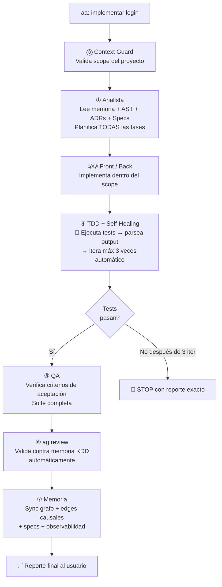

<div align="center">

# 🤖 Agentic KDD

**Un desarrollador. La capacidad de un departamento.**

*Autonomous development pipeline con memoria persistente, enforcement mecánico y 23 MCP tools nativas*

[](https://www.npmjs.com/package/agentic-kdd)
[](https://www.npmjs.com/package/agentic-kdd-mcp)
[](LICENSE)
[](https://nodejs.org)
[](https://cursor.sh)
[](https://claude.ai/code)

</div>

---

## ¿Qué es Agentic KDD?

Agentic KDD (Knowledge-Driven Development) es un framework de desarrollo con IA que vive **dentro de tu proyecto** — no en la nube, no en un SaaS externo. Un directorio `.agentic/` con código Node.js + una base de datos SQLite que aprende con cada ciclo de trabajo.

La diferencia fundamental con cualquier otro asistente de IA:

> **Sin Agentic KDD:** el agente olvida todo al cerrar el chat. Cada sesión empieza desde cero.  
> **Con Agentic KDD:** el agente recuerda cada error, conoce cada dependencia, entiende cada decisión de diseño, y verifica mecánicamente que el trabajo esté hecho antes de marcarlo como completado.

```
aa: implementar autenticación con JWT
```
*Y el agente ejecuta solo. Sin interrupciones. Con memoria real.*

---

## Métricas de rendimiento

```
Autonomía del agente
────────────────────────────────────────────────────────────
Base (sin framework)     ████░░░░░░░░░░░░░░░░░░░░░░  20%
Con Agentic v2           ████████░░░░░░░░░░░░░░░░░░  40%
+ Harness (Fase 0)       ████████████░░░░░░░░░░░░░░  58%
+ AST + Causal (Fase 1)  ██████████████░░░░░░░░░░░░  70%
+ Knowledge (Fase 2)     ████████████████░░░░░░░░░░  80%
+ Specs + Impact (Fase 3)█████████████████████████░  95%

Reducción de tokens
────────────────────────────────────────────────────────────
Tarea corta (fix/feature)        Sin Agentic: ~8K  → Con v3: ~2K   (−4×)
Tarea larga (feature completo)   Sin Agentic: ~80K → Con v3: ~8K   (−10×)
Proyecto grande (50K+ líneas)    Sin Agentic: ~120K→ Con v3: ~8K   (−15×)

Fuente: Codebase-Memory arXiv 2603.27277 (2026) — 83% calidad con 10× menos tokens
```

| Métrica | Valor |
|---------|-------|
| Autonomy Score (proyectos con v3 completo) | ~95% |
| Reducción de tokens promedio | 10–15× |
| Multiplicador de output por dev | 5–8× |
| MCP tools disponibles | 23 |
| Lenguajes soportados (AST) | 12 |
| Capas de memoria (CoALA v3) | 4 |

---

## Cómo funciona — el pipeline `aa:`

Cada instrucción `aa: [tarea]` ejecuta este pipeline **sin interrumpir al usuario**:



**El usuario nunca escribe `ag: test` o `ag: review` — ocurren solos.**

---

## Arquitectura de memoria — CoALA v3

Agentic KDD implementa la arquitectura **CoALA (Cognitive Architecture for Language Agents)** adaptada para desarrollo de software, completamente offline en SQLite.

```
┌─────────────────────────────────────────────────────────────────┐
│  WORKING MEMORY       Buffer de la sesión activa                │
│  ─────────────────    "lo que está en el context window ahora"  │
│                                                                 │
│  EPISODIC             Trayectorias crudas de lo que ocurrió     │
│  ─────────────────    "qué se intentó, en qué orden, resultado" │
│                                                                 │
│  SEMANTIC             Mapa del proyecto + grafo de entidades    │
│  ─────────────────    "qué módulos existen, cómo se conectan"   │
│                                                                 │
│  PROCEDURAL           Patrones, errores, decisiones             │
│  ─────────────────    "reglas que el agente aplica siempre"     │
│                                                                 │
│  AST GRAPH (v3)       Grafo de símbolos + call graph + PageRank │
│  CAUSAL EDGES (v3)    caused_failure · was_fixed_by · tested_by │
│  KNOWLEDGE DOCS (v3)  ADRs + gotchas + convenciones             │
└─────────────────────────────────────────────────────────────────┘
                              │
                    .agentic/memoria.db
                    (SQLite offline, viaja con el proyecto)
```

### Señales de confianza — cómo aprende el sistema

```
BAJA   → sugerencia, no forzada
MEDIA  → se aplica, se menciona en el plan
ALTA   → regla fija, el agente la aplica siempre sin excepción

Aplicado ≥ 3 + utilidad ≥ 70%  →  promoción automática a MEDIA
Aplicado ≥ 7 + utilidad ≥ 80%  →  promoción automática a ALTA
Sin uso en 60 ciclos            →  degradación automática
```

---

## Las 5 fases del sistema

### Fase 0 — Harness: enforcement determinista

> *"El modelo propone, el harness verifica."*

El harness es la pieza que más falta hace en todos los frameworks de agentes. Sin gates deterministas, el agente puede declarar que completó TDD sin ejecutar un solo test. Con el harness, eso es imposible a nivel de código.

- **`harness.cjs`** → motor PRE/EXEC/POST para los 8 pasos del pipeline. Ningún paso avanza sin que el gate verifique el output.
- **`tdd-gate.cjs`** → loop mecánico en Node.js: detecta tests, ejecuta, parsea output (Jest/Vitest/Mocha/pytest), itera máx 3 veces, reporta. El agente no puede mentir sobre tests pasando.
- **`harness-rules.md`** → reglas imperativas ("NUNCA", "PROHIBIDO") re-inyectadas en cada paso.

### Fase 1 — Discernimiento: mapa del código

El agente ve el proyecto completo antes de planificar cualquier cambio.

- **`ast-indexer.cjs`** → grafo AST con tree-sitter (12 lenguajes), fallback regex. Extrae funciones, clases, imports, call graph → SQLite con PageRank estilo Aider.
- **`causal-edges.cjs`** → memoria causal bi-temporal: `caused_failure`, `was_fixed_by`, `tested_by`, `regressed_by`. Nunca se borran — se invalidan.

### Fase 2 — Base de conocimiento: el agente entiende el "por qué"

> *"El código explica QUÉ. Los ADRs explican POR QUÉ."*

- **`adr-ingestor.cjs`** → parsea ADRs (Architecture Decision Records) en formato MADR. Frontmatter → edges tipados sin LLM.
- **`knowledge-ingestor.cjs`** → ingesta gotchas, convenciones y runbooks con frontmatter validado.

### Fase 3 — Autonomía: cierre del loop al ~95%

- **`spec-manager.cjs`** → specs estilo Kiro (AWS) con wave execution. Wave 1 = tareas sin dependencias, Wave 2 = dependen de Wave 1, etc.
- **`impact-analyzer.cjs`** → análisis de impacto pre-cambio: AST + causal + knowledge → severidad ALTO/MEDIO/BAJO antes de tocar algo.

### Fase 4 — Expansión

- **Multi-lenguaje** → mismo pipeline para JS/TS, Python, Go, Rust, Java, Kotlin, C++, PHP, Ruby, Swift, C#, Scala.
- **Modo colaborativo** → libSQL/Turso Sync: varios devs comparten la misma memoria del agente.

---

## Instalación

```bash
# Instalar la CLI globalmente
npm install -g agentic-kdd

# Ir al proyecto
cd mi-proyecto

# Instalar Agentic KDD en el proyecto
akdd init
```

`akdd init` detecta el stack, descarga los archivos del repo, instala dependencias, configura el MCP server en Cursor automáticamente, y te da un solo comando para terminar la configuración desde el IDE.

### Requisitos

- Node.js 18+
- Cursor, Claude Code, o cualquier cliente MCP
- SQLite: `better-sqlite3` (se instala automáticamente) o Node.js 22+

---

## Comandos CLI — referencia completa

### Setup y diagnóstico

| Comando | Descripción |
|---------|-------------|
| `akdd init` | Instalar Agentic KDD en el proyecto actual |
| `akdd update` | Actualizar agentes + módulos sin tocar la memoria |
| `akdd health` | Diagnóstico completo: qué está configurado, qué falta |
| `akdd health --fix` | Auto-arreglar problemas detectados |
| `akdd mcp` | Configurar MCP server en Cursor/Claude Code automáticamente |
| `akdd mcp status` | Ver estado de la configuración MCP |
| `akdd mcp --global` | Configurar MCP globalmente para todos los proyectos |

### Memoria y conocimiento

| Comando | Descripción |
|---------|-------------|
| `akdd sync` | Sincronizar archivos markdown → grafo SQLite |
| `akdd graph` | Sync + mostrar stats del grafo |
| `akdd stats` | Stats del grafo y reglas ALTA |
| `akdd coala` | Stats completo de las 4 capas CoALA |
| `akdd buscar "query"` | Búsqueda híbrida en toda la memoria |
| `akdd impacto "Módulo"` | Impacto semántico de una entidad |
| `akdd decay` | Aplicar decay temporal a patrones inactivos |
| `akdd audit` | Auditoría de memoria: stale, contradicciones, propuestas |
| `akdd forget <id>` | Olvidar una entrada de memoria con razón documentada |

### AST e impacto

| Comando | Descripción |
|---------|-------------|
| `akdd ast` | Indexar proyecto en el grafo AST |
| `akdd ast stats` | Stats del índice AST |
| `akdd ast symbols <archivo>` | Símbolos extraídos de un archivo |
| `akdd ast-impact <archivo>` | Análisis completo de impacto (AST + causal + knowledge) |
| `akdd why <entidad>` | Explicar por qué existe algo (cadena causal completa) |

### Specs y autonomía

| Comando | Descripción |
|---------|-------------|
| `akdd spec list` | Listar todos los specs del proyecto |
| `akdd spec <módulo>` | Estado del spec + próxima wave |
| `akdd spec create <módulo>` | Crear spec de feature |
| `akdd spec create <módulo> --bugfix` | Crear spec de bugfix |

### Knowledge base

| Comando | Descripción |
|---------|-------------|
| `akdd adr` | Ingestar ADRs desde `docs/adr/` |
| `akdd knowledge` | Ingestar gotchas y convenciones |

### Métricas y observabilidad

| Comando | Descripción |
|---------|-------------|
| `akdd metrics` | KPIs del proyecto: éxito, retrabajo, autonomy score, tokens |
| `akdd metrics trend` | Tendencia de los últimos 10 ciclos |
| `akdd trail` | Últimos decision trails (qué cambió y por qué) |
| `akdd trail <ciclo_id>` | Trail completo de un ciclo específico |
| `akdd trail why <entidad>` | Por qué existe este archivo/módulo |

### Inteligencia v2.2

| Comando | Descripción |
|---------|-------------|
| `akdd git-context` | Análisis del diff de Git + risk assessment |
| `akdd predict` | Patrones de riesgo predictivos desde memoria episódica |
| `akdd embed-status` | Estado de embeddings locales (all-MiniLM-L6-v2) |
| `akdd embed-install` | Instalar embeddings locales (~23MB, 100% offline) |
| `akdd jina-install` | Instalar jina-v2-code embeddings (~500MB, optimizado para código) |
| `akdd ci-install` | Instalar workflow de GitHub Actions para CI/CD automático |
| `akdd ci-status` | Ver últimos reportes de CI/CD |
| `akdd dashboard` | Abrir dashboard visual en el navegador |

---

## MCP Server — 23 tools nativas

Agentic KDD incluye un MCP server completo. Cursor y Claude Code lo descubren automáticamente después de `akdd init`. Las tools están disponibles directamente en el chat del IDE, sin bash commands intermedios.

### Configuración manual (si akdd init no la hizo automáticamente)

```json
// .cursor/mcp.json
{
  "mcpServers": {
    "agentic-kdd": {
      "command": "node",
      "args": [".agentic/grafo/mcp-server.cjs"]
    }
  }
}
```

```bash
# Claude Code
claude mcp add agentic-kdd -- node .agentic/grafo/mcp-server.cjs

# O con el paquete npm
npx agentic-kdd-mcp
```

### Tools disponibles

| Tool MCP | Categoría | Descripción |
|----------|-----------|-------------|
| `grafo_buscar` | Memoria | Búsqueda híbrida en 4 capas CoALA |
| `registrar_episodio` | Memoria | Registrar episodio crudo en memoria episódica |
| `grafo_sync` | Memoria | Sincronizar markdown → SQLite |
| `grafo_impacto` | Memoria | Impacto semántico de una entidad |
| `registrar_entidad` | Memoria | Registrar entidad en grafo semántico |
| `grafo_coala` | Memoria | Stats completo de las 4 capas |
| `grafo_predecir` | Memoria | Estimación de riesgo pre-tarea |
| `verdad_vigente` | Memoria | Solo reglas vigentes HOY (excluye histórico/obsoleto) |
| `ast_impact` | AST | Impacto completo (AST + causal + knowledge) |
| `ast_index` | AST | Indexar proyecto en grafo AST |
| `ast_symbols` | AST | Símbolos de un archivo específico |
| `impact_precheck` | AST | Pre-check de impacto para un módulo |
| `impact_diff` | AST | Impacto combinado de varios archivos |
| `spec_waves` | Specs | Waves de ejecución del spec de un módulo |
| `spec_status` | Specs | Estado del spec (% completado, próxima wave) |
| `spec_create` | Specs | Crear spec nuevo (feature/bugfix) |
| `knowledge_query` | Knowledge | Consultar ADRs y gotchas de un módulo |
| `adr_ingest` | Knowledge | Ingestar ADRs en knowledge base |
| `causal_add` | Causal | Registrar edge causal |
| `causal_query` | Causal | Consultar historial causal |
| `decision_trail` | Observabilidad | Trail completo de un ciclo |
| `decision_why` | Observabilidad | Por qué existe algo (cadena causal) |
| `recent_ciclos` | Observabilidad | Últimos N ciclos |
| `metrics_summary` | Observabilidad | KPIs operacionales del proyecto |
| `health_check` | Diagnóstico | Diagnóstico completo del sistema |
| `memory_audit` | Diagnóstico | Auditoría de memoria (stale, contradicciones) |
| `memory_forget` | Diagnóstico | Olvidar entrada con razón documentada |

---

## Los 9 agentes especializados

| Agente | Rol |
|--------|-----|
| `00-setup` | Configuración inicial — mapea el proyecto una sola vez |
| `01-orquestador` | Director del pipeline `aa:` — dirige el flujo completo |
| `02-analista` | Convierte la instrucción en plan técnico — lee memoria + AST + ADRs |
| `03-front` | Implementa frontend (React, Vue, HTML/CSS, mobile) |
| `04-back` | Implementa backend (APIs, lógica, DB, servicios) |
| `05-qa` | Verifica criterios de aceptación + suite completa |
| `06-tdd` | TDD + self-healing mecánico via `tdd-gate.cjs` |
| `07-memoria` | Sincroniza las 4 capas, registra edges causales, actualiza specs |
| `08-aprende` | Consolida episodios → patrones reutilizables |
| `09-sprint` | Protocolo de sprints — múltiples tareas sin intervención |

### Agentes pro (especializados)

| Agente | Rol |
|--------|-----|
| `ag-review` | Code review automático contra memoria KDD — se ejecuta sin pedirlo |
| `ag-refactor` | Refactors seguros con análisis de impacto previo |
| `ag-doc` | Documentación técnica desde código y memoria del proyecto |
| `ag-test` | Suites de tests basadas en errores históricos del proyecto |

---

## ¿Qué lo diferencia?

| | Agentic KDD v3 | Cursor Rules | GitHub Copilot | LangGraph | CrewAI |
|---|:---:|:---:|:---:|:---:|:---:|
| Memoria persistente entre sesiones | ✅ SQLite | ❌ | ❌ | ⚠️ parcial | ❌ |
| Gates deterministas (harness) | ✅ | ❌ | ❌ | ⚠️ manual | ❌ |
| Grafo AST del codebase | ✅ | ❌ | ⚠️ limitado | ❌ | ❌ |
| Knowledge base (ADRs/gotchas) | ✅ | ❌ | ❌ | ❌ | ❌ |
| Self-healing mecánico en código | ✅ | ❌ | ❌ | ⚠️ config | ❌ |
| Edges causales bi-temporales | ✅ | ❌ | ❌ | ❌ | ❌ |
| Pipeline de 8 pasos autónomo | ✅ | ❌ | ❌ | ✅ | ✅ |
| Funciona 100% offline | ✅ | ✅ | ❌ | ⚠️ | ❌ |
| Vive dentro del proyecto (no SaaS) | ✅ | ✅ | ❌ | ❌ | ❌ |
| MCP server nativo (23 tools) | ✅ | ❌ | ❌ | ❌ | ❌ |
| Observabilidad de decisiones | ✅ | ❌ | ❌ | ⚠️ | ❌ |
| Multi-lenguaje (12 lenguajes) | ✅ | ✅ | ✅ | ✅ | ✅ |

### La ventaja real

Cursor Rules son pistas que el modelo puede ignorar. Agentic KDD tiene **gates en código** que verifican el output antes de avanzar. La diferencia:

```
Cursor Rules:   "Prefiere ejecutar tests antes de entregar"
                → el agente lo sigue cuando quiere

Agentic KDD:    if (tests_passing === false) return STOP("Gate determinista")
                → el código rechaza el avance sin prueba de cumplimiento
```

---

## Flujo de conocimiento

```
Ciclo aa: [tarea]
   │
   ├─ ANTES   → Analista consulta grafo + AST + ADRs + gotchas + spec
   │              "¿Qué sé? ¿Qué restricciones aplican? ¿Qué puede fallar?"
   │
   ├─ DURANTE → Harness verifica cada paso en código
   │              "¿El agente probó lo que dice que hizo?"
   │
   └─ DESPUÉS → Memoria registra episodio + edges causales + spec actualizado
                  "¿Qué aprendimos? ¿Qué causó qué? ¿Qué restricción nueva aplica?"

Próximo ciclo: el sistema sabe más que en el ciclo anterior.
```

---

## Dashboard visual

```bash
akdd dashboard
```

Abre un dashboard interactivo en el navegador con:

- **Knowledge Graph** — grafo D3.js de toda la memoria del proyecto (drag & drop, pin nodos, slider de repulsión, spread automático)
- **Project Docs** — documentación del proyecto generada desde el código
- **Nodes** — browser de patrones, errores y decisiones con búsqueda
- **Stats** — métricas de ciclos, autonomy score, calidad de memoria

---

## Estructura del proyecto después de `akdd init`

```
tu-proyecto/
├── .agentic/
│   ├── agentes/          → 9 agentes + 4 pro (archivos .md)
│   │   ├── 01-orquestador.md
│   │   ├── 02-analista.md
│   │   └── ... (9 agentes)
│   ├── grafo/            → 19 módulos Node.js
│   │   ├── grafo.cjs         — motor principal de memoria
│   │   ├── harness.cjs       — enforcement de pipeline
│   │   ├── tdd-gate.cjs      — self-healing mecánico
│   │   ├── ast-indexer.cjs   — grafo AST
│   │   ├── causal-edges.cjs  — memoria causal
│   │   ├── adr-ingestor.cjs  — knowledge base
│   │   ├── spec-manager.cjs  — wave execution
│   │   ├── impact-analyzer.cjs — pre-change analysis
│   │   ├── decision-trail.cjs  — observabilidad
│   │   ├── metrics.cjs         — KPIs
│   │   ├── memory-audit.cjs    — auditoría
│   │   ├── health-check.cjs    — diagnóstico
│   │   ├── mcp-server.cjs      — 23 MCP tools
│   │   └── ...
│   ├── memoria/          → patrones, errores, decisiones (.md)
│   ├── specs/            → specs de módulos con wave execution
│   ├── conocimiento/     → ADRs, gotchas, convenciones
│   ├── config.md         → stack, módulos, reglas del proyecto
│   └── memoria.db        → SQLite con toda la memoria
├── .cursor/
│   └── mcp.json          → configurado automáticamente por akdd init
├── .audit/               → 7 agentes de QA especializados
├── dashboard.cjs         → dashboard visual interactivo
├── CLAUDE.md             → activa aa: / ag: / audit:
└── .cursorrules          → reglas para Cursor
```

---

## Quickstart en 3 pasos

```bash
# 1. Instalar CLI
npm install -g agentic-kdd

# 2. Instalar en tu proyecto
cd mi-proyecto
akdd init

# 3. Abrir en Cursor o Claude Code y configurar
aa: configurar
```

Después de `aa: configurar` el sistema mapea tu codebase completo, detecta el stack, y está listo para trabajar. A partir de ahí, solo:

```
aa: [descripción de la tarea]
```

---

## Actualizar un proyecto existente

```bash
# Solo esto — la memoria queda intacta
akdd update
```

`akdd update` descarga los nuevos módulos de GitHub y los instala en `.agentic/`. Las migraciones del schema SQLite corren automáticamente en el siguiente ciclo.

---

## Cambiar de IDE (Cursor → Claude Code o viceversa)

No necesitas reconfigurar nada. La memoria vive en el proyecto, no en el IDE. El único paso al cambiar de IDE:

```bash
akdd mcp
```

---

## Paquetes npm

| Paquete | Descripción | Versión |
|---------|-------------|---------|
| [`agentic-kdd`](https://www.npmjs.com/package/agentic-kdd) | CLI: init, update, health, ast, metrics, trail y más |  |
| [`agentic-kdd-mcp`](https://www.npmjs.com/package/agentic-kdd-mcp) | MCP server standalone: 23 tools para Cursor/Claude Code |  |

---

## Compatibilidad

| IDE / Cliente | Soporte | Notas |
|---------------|---------|-------|
| **Cursor** | ✅ Completo | MCP auto-configurado en `akdd init` |
| **Claude Code** | ✅ Completo | `claude mcp add` automático |
| **VS Code** | ✅ Via extensión | Ver `vscode-extension/` |
| **Windsurf** | ✅ Via MCP | Configuración manual de `.cursor/mcp.json` |
| **JetBrains** | ⚠️ Parcial | MCP en beta en JetBrains AI |

---

## License

MIT © [Adrianlpz211](https://github.com/Adrianlpz211)

---

<div align="center">

**[npm agentic-kdd](https://www.npmjs.com/package/agentic-kdd)** · **[npm agentic-kdd-mcp](https://www.npmjs.com/package/agentic-kdd-mcp)** · **[GitHub](https://github.com/Adrianlpz211/Agentic-KDD)**

*Un desarrollador. La capacidad de un departamento.*

</div>
