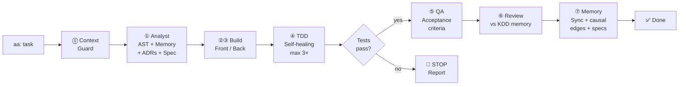

<div align="center">

<br/>

```
  ┌─────────────────────────────────────────────────────────────┐
  │                                                             │
  │     ⚔️  AGENTIC KDD                                         │
  │                                                             │
  │     A development team of one.                              │
  │     A team becomes a legion.                                │
  │                                                             │
  └─────────────────────────────────────────────────────────────┘
```

**The AI development framework that turns one developer into a full team —**  
**and a team into a legion.**

<br/>

[](https://www.npmjs.com/package/agentic-kdd)
[](https://www.npmjs.com/package/agentic-kdd-mcp)
[](LICENSE)
[](https://nodejs.org)
[](https://cursor.sh)
[](https://claude.ai/code)

</div>

---

## The premise

Captain America doesn't wait for backup to fight. Alone, he operates at the level of an entire unit — because of what he carries inside: training, judgment, memory, discipline. Every battle makes him better than the last.

**Agentic KDD is your super soldier serum.**


One developer with Agentic KDD active doesn't work like a developer with an autocomplete tool. They work like a team — because the system carries what a team would normally carry: memory of every past decision, a structural map of every dependency, rules that enforce quality at the code level, and a knowledge base that answers *why* things are the way they are.

And when the battle is too big for one person?

```
aa: Avengers, assemble.
```

**Collaborative mode activates. The legion deploys. Every developer on the team shares the same memory, the same lessons, the same knowledge base.** What one person learned, the system knows for everyone — from day one.

```
One developer  +  Agentic KDD           =  An army of one
A team         +  Agentic KDD collab    =  A legion
```

---

## What is KDD?

**Knowledge-Driven Development** is the methodology at the core of Agentic KDD.

The fundamental problem with AI-assisted development today: **the agent forgets everything when you close the chat.** Every session starts from zero. Every bug that was already solved gets solved again. Every architectural decision that was already made gets questioned again. Every dependency that already caused a problem breaks the project again.

KDD solves this by making knowledge the primary driver of development — not the prompt, not the model, not the session.

```
Traditional AI development:
  Session 1 → agent learns about your project → session ends → forgotten
  Session 2 → start over → same mistakes → same time wasted

KDD:
  Session 1 → agent learns → knowledge persists in SQLite
  Session 2 → agent already knows → builds on top of what came before
  Session N → system is smarter than it was on day one
```

Every `aa:` cycle — Analyze, Build, Test, QA, Review, Remember — adds to a persistent knowledge graph that lives inside your project. The agent gets better with every task, not just every session.

---

## Who is this for?

| Developer type | What Agentic KDD gives you |
|---|---|
| **Solo developer** | The capacity of a full team. Architect, QA, tech lead, senior — all running automatically. |
| **Small team (2–5 devs)** | Shared memory. What one person learns, everyone knows. No more siloed knowledge. |
| **Freelancer / agency** | Context that persists across projects. Start every new engagement with your accumulated wisdom intact. |
| **Vibe coder / non-traditional dev** | AI that actually knows your project — not just your current file. |
| **Any developer using Cursor or Claude Code** | Works where you already work. No new tools, no new workflow. |

---

## Where is it used?

Agentic KDD works in any software project — web, mobile, backend, scripts, APIs. It has been used in production on:

- **SaaS platforms** (Node.js, TypeScript, Next.js, React)
- **ERP systems** (SQL Server, complex relational schemas)
- **WhatsApp automation** (Baileys, webhook flows)
- **REST / GraphQL APIs** (Express, Fastify, Prisma)
- **Mobile apps** (React Native, Flutter)

If you write code in a directory and want an AI agent that actually understands your project — Agentic KDD works there.

---

## Supported languages

The AST indexer extracts structural knowledge from 12 languages using the same pipeline:

```
JavaScript · TypeScript · Python · Go · Rust
Java · Kotlin · C++ · PHP · Ruby · Swift · C#
```

The agent understands your codebase regardless of the language. Same memory architecture, same enforcement, same pipeline.

---

## How it works — the `aa:` pipeline

One command. Eight automatic steps. No interruptions.

```bash
aa: implement JWT authentication with refresh token rotation
```



**The developer never types `ag: test` or `ag: review` — they happen automatically.**

The key difference from any other agent framework: **each step has a deterministic gate.** The agent cannot declare TDD complete without running the actual test suite. The gate rejects the step if tests haven't passed. No exceptions.

```
Every other framework:   "Run tests before delivering" → agent follows this when it wants to
Agentic KDD harness:     if (tests_passing === false) { STOP("gate rejected") }
```

---

## Memory architecture — CoALA v3

Four persistent memory layers, fully offline, in a SQLite file that lives inside your project and travels with it.

```
.agentic/memoria.db
│
├── WORKING MEMORY      Active session buffer
│                       "what's in the context window right now"
│
├── EPISODIC MEMORY     Raw trajectories of every cycle
│                       "what was tried, in what order, what was the result"
│
├── SEMANTIC MEMORY     Project entity graph + AST
│                       "what modules exist, how they connect, call graph"
│
├── PROCEDURAL MEMORY   Patterns, errors, decisions
│                       "rules the agent applies on every cycle — forever"
│
├── AST GRAPH (v3)      Symbols · imports · call graph · PageRank
│                       "complete structural map of the codebase"
│
├── CAUSAL EDGES (v3)   caused_failure · was_fixed_by · tested_by
│                       "what caused what — history that never disappears"
│
└── KNOWLEDGE DOCS (v3) ADRs · gotchas · conventions
                        "why things were decided the way they were"
```

### How the system gets smarter

Every memory node has a confidence signal that updates automatically:

```
LOW    → suggestion, not enforced
MEDIUM → applied and mentioned in every plan
HIGH   → fixed rule, applied on every cycle without exception — forever

Applied ≥ 3×  + utility ≥ 70%  →  auto-promoted to MEDIUM
Applied ≥ 7×  + utility ≥ 80%  →  auto-promoted to HIGH
Unused for 60 cycles            →  auto-degraded (temporal decay)
```

The system doesn't just remember — it prioritizes. The most battle-tested knowledge rises to the top automatically.

---

## Performance

```
Autonomy vs no framework
─────────────────────────────────────────────────────────────
No AI framework          ████░░░░░░░░░░░░░░░░░░░░░░░  20%
Cursor rules only        ████████░░░░░░░░░░░░░░░░░░░  35%
Agentic KDD v2           ████████████░░░░░░░░░░░░░░░  48%
+ Harness (Phase 0)      ████████████████░░░░░░░░░░░  58%
+ AST + Causal (Phase 1) ██████████████████░░░░░░░░░  70%
+ Knowledge (Phase 2)    ████████████████████░░░░░░░  80%
+ Specs + Impact (Phase 3)███████████████████████████  95%

Token reduction vs no persistent memory
─────────────────────────────────────────────────────────────
Short task (fix / small feature)   ~8K  →  ~2K   tokens   −4×
Long task (full feature)           ~80K →  ~8K   tokens  −10×
Large project (50K+ lines)         ~120K→  ~8K   tokens  −15×
```

> Codebase-Memory (arXiv 2603.27277, 2026): 83% output quality with 10× fewer tokens using a graph-backed approach vs blind file exploration.

---

## Installation

### Requirements

- **Node.js 18+**
- **Cursor**, **Claude Code**, or any MCP-compatible client
- SQLite: `better-sqlite3` (installed automatically) or Node.js 22+

### Install the CLI

```bash
npm install -g agentic-kdd
```

### Deploy in your project

```bash
cd my-project
akdd init
```

`akdd init` does everything automatically:
- Detects your stack (package.json, config files, directory structure)
- Downloads the latest agents and modules from GitHub
- Installs dependencies
- Configures the MCP server in Cursor (writes `.cursor/mcp.json`)
- Tries to register with Claude Code via `claude mcp add`

### First run

Open the project in Cursor or Claude Code:

```
aa: configure
```

The system maps your entire codebase once. After that, every `aa:` cycle builds on accumulated knowledge.

---

## CLI Reference

### Setup

```bash
akdd init              # Deploy Agentic KDD in the current project
akdd update            # Update agents + modules (memory stays intact)
akdd health            # Full system diagnostic
akdd health --fix      # Auto-fix detected issues
```

### MCP Server

```bash
akdd mcp               # Auto-configure MCP in Cursor / Claude Code
akdd mcp status        # Check MCP configuration
akdd mcp --global      # Configure globally for all projects
```

### Memory

```bash
akdd sync              # Sync markdown → SQLite graph
akdd coala             # Stats across all 4 CoALA memory layers
akdd buscar "query"    # Hybrid search across all memory
akdd decay             # Apply temporal decay to inactive patterns
akdd audit             # Memory audit: stale, contradictions, proposals
akdd forget <id>       # Invalidate a memory entry with documented reason
```

### AST & Impact

```bash
akdd ast               # Index project into AST graph
akdd ast stats         # AST index stats
akdd ast-impact <file> # Full impact analysis (AST + causal + knowledge)
akdd why <entity>      # Why does this exist? Full causal chain.
```

### Specs

```bash
akdd spec list                     # List all module specs
akdd spec <module>                 # Status + next execution wave
akdd spec create <module>          # Create a feature spec
akdd spec create <module> --bugfix # Create a bugfix spec
```

### Knowledge Base

```bash
akdd adr               # Ingest ADRs from docs/adr/
akdd knowledge         # Ingest gotchas and conventions
```

### Metrics & Observability

```bash
akdd metrics           # Project KPIs: success rate, rework, autonomy score
akdd metrics trend     # Trend across last 10 cycles
akdd trail             # Recent decision trails
akdd trail <cycle_id>  # Full trail: what changed, why, what memory influenced it
akdd trail why <file>  # Why does this file/module exist?
```

### Collaborative Mode — The Legion

```bash
akdd collab init              # Activate — creates shared DB automatically
akdd collab invite            # Generate invite code for a team member (24h, one-use)
akdd collab join <code>       # Join the team with an invite code
akdd collab push              # Push your learnings to the team
akdd collab pull              # Pull team's latest learnings
akdd collab status            # Check sync status and connection
```

### Intelligence

```bash
akdd git-context       # Git diff analysis + risk assessment
akdd predict           # Predictive risk from episodic memory
akdd embed-install     # Install local embeddings (~23MB, 100% offline)
akdd ci-install        # Install GitHub Actions CI/CD memory workflow
akdd dashboard         # Open interactive visual knowledge graph
```

---

## Collaborative Mode — Avengers, assemble.

When one developer isn't enough, you don't start over. You call for backup.

```bash
# Project lead (once, when starting team mode):
akdd collab init
→ Shared database created automatically
→ All existing project memory uploaded

akdd collab invite
→ ══════════════════════════════════
→   🔑 Invite Code: LUMO-RL5C22
→   Expires: 24 hours · One use only
→   Share via Slack / WhatsApp
→ ══════════════════════════════════

# New team member (on their machine):
git clone [repo]
npm install -g agentic-kdd
akdd collab join LUMO-RL5C22
→ ✅ Connected. Downloading team memory...
→ ✅ Ready. 6 months of project knowledge — from day one.
```

### What gets shared

```
✅ Patterns (HIGH confidence rules the team discovered)
✅ Error history (what broke, what fixed it)
✅ Architectural decisions (ADRs and gotchas)
✅ Causal edges (what causes what in this codebase)
✅ AST knowledge (structural map of the project)

❌ Working memory (your active session — private)
❌ Code (that's Git — unchanged)
```

### How knowledge flows

```
María (Spain) works on the leads module at 10am
  → Discovers: LeadService.ts has a timezone bug with VEN/ESP offset
  → Auto-sync to shared DB at cycle end

Mario (Venezuela) starts his session at 2pm
  → Auto-pull from shared DB
  → Agent already knows about the timezone issue
  → Mario's plan includes the fix — before he knew it was a problem
```

---

## MCP Server — 23 native tools

After `akdd init`, Cursor and Claude Code discover the MCP server automatically. Every capability is available as a native tool in the IDE chat.

```json
// .cursor/mcp.json (written automatically by akdd init)
{
  "mcpServers": {
    "agentic-kdd": {
      "command": "node",
      "args": [".agentic/grafo/mcp-server.cjs"]
    }
  }
}
```

**Memory:** `grafo_buscar` · `verdad_vigente` · `grafo_predecir` · `registrar_episodio`

**AST:** `ast_impact` · `ast_index` · `ast_symbols` · `impact_precheck` · `impact_diff`

**Specs:** `spec_waves` · `spec_status` · `spec_create`

**Knowledge:** `knowledge_query` · `adr_ingest`

**Causal:** `causal_add` · `causal_query`

**Observability:** `decision_trail` · `decision_why` · `recent_ciclos` · `metrics_summary`

**Diagnostics:** `health_check` · `memory_audit` · `memory_forget`

---

## The five phases

| Phase | What it adds | Autonomy |
|---|---|---|
| **0 — Harness** | Deterministic gates. The agent cannot lie about completing TDD. | +18% |
| **1 — Discernment** | Full AST graph + causal memory. The agent sees the entire codebase before acting. | +12% |
| **2 — Knowledge Base** | ADRs + gotchas. The agent understands *why*, not just *what*. | +10% |
| **3 — Autonomy** | Kiro-style specs with wave execution + pre-change impact analysis. | +15% |
| **4 — Legion** | Collaborative memory via Turso. Team shares one knowledge base. | ∞× |

---

## How Agentic KDD compares

| | Agentic KDD | Cursor Rules | GitHub Copilot | LangGraph | CrewAI |
|---|:---:|:---:|:---:|:---:|:---:|
| Persistent memory across sessions | ✅ SQLite | ❌ | ❌ | ⚠️ | ❌ |
| Deterministic enforcement gates | ✅ | ❌ | ❌ | ⚠️ | ❌ |
| Full codebase AST graph | ✅ | ❌ | ⚠️ | ❌ | ❌ |
| Knowledge base (ADRs / gotchas) | ✅ | ❌ | ❌ | ❌ | ❌ |
| Mechanical self-healing loop | ✅ | ❌ | ❌ | ⚠️ | ❌ |
| 8-step autonomous pipeline | ✅ | ❌ | ❌ | ✅ | ✅ |
| 100% offline — no external APIs | ✅ | ✅ | ❌ | ⚠️ | ❌ |
| Lives inside the project (no SaaS) | ✅ | ✅ | ❌ | ❌ | ❌ |
| Native MCP server (23 tools) | ✅ | ❌ | ❌ | ❌ | ❌ |
| Collaborative shared memory | ✅ Turso | ❌ | ❌ | ❌ | ❌ |
| Bi-temporal causal edges | ✅ | ❌ | ❌ | ❌ | ❌ |

---

## Switching IDEs

Memory lives in the project, not the IDE. When switching between Cursor and Claude Code:

```bash
akdd mcp
```

One command. Everything else is already there.

---

## Updating an existing project

```bash
akdd update
```

Downloads the latest modules from GitHub. Schema migrations run automatically. **Memory stays intact.**

---

## Project structure

```
your-project/
├── .agentic/
│   ├── agentes/              9 specialized agents + 4 pro
│   ├── grafo/                19 Node.js modules
│   │   ├── grafo.cjs         CoALA v3 memory engine
│   │   ├── harness.cjs       deterministic pipeline enforcement
│   │   ├── tdd-gate.cjs      mechanical self-healing loop
│   │   ├── ast-indexer.cjs   AST graph — 12 languages
│   │   ├── causal-edges.cjs  bi-temporal causal memory
│   │   ├── adr-ingestor.cjs  knowledge base (ADRs)
│   │   ├── spec-manager.cjs  Kiro-style wave execution
│   │   ├── impact-analyzer.cjs  pre-change impact analysis
│   │   ├── decision-trail.cjs   decision observability
│   │   ├── metrics.cjs          project KPIs
│   │   ├── memory-audit.cjs     memory governance
│   │   ├── health-check.cjs     system diagnostics
│   │   ├── mcp-server.cjs       23 MCP tools
│   │   └── collab-manager.cjs   collaborative sync
│   ├── memoria/              patterns · errors · decisions (.md)
│   ├── specs/                module specs with wave execution
│   ├── conocimiento/         ADRs · gotchas · conventions
│   ├── config.md             project stack and rules
│   └── memoria.db            SQLite — all memory lives here
├── .cursor/mcp.json          auto-configured by akdd init
├── .audit/                   7 specialized QA agents
├── dashboard.cjs             interactive knowledge graph dashboard
├── CLAUDE.md                 activates aa: / ag: / audit:
└── .cursorrules              Cursor rules
```

---

## Packages

| Package | Description |
|---|---|
| [`agentic-kdd`](https://www.npmjs.com/package/agentic-kdd) | CLI — init, update, health, ast, metrics, trail, collab, mcp |
| [`agentic-kdd-mcp`](https://www.npmjs.com/package/agentic-kdd-mcp) | Standalone MCP server — 23 tools for Cursor and Claude Code |

---

## Compatibility

| IDE / Client | Support |
|---|---|
| **Cursor** | ✅ Full — MCP auto-configured on `akdd init` |
| **Claude Code** | ✅ Full — `claude mcp add` runs automatically |
| **VS Code** | ✅ Via extension scaffold |
| **Windsurf** | ✅ Via MCP manual config |

---

## License

MIT © [Adrianlpz211](https://github.com/Adrianlpz211)

---

<div align="center">

<br/>

**[npm](https://www.npmjs.com/package/agentic-kdd)** · **[mcp](https://www.npmjs.com/package/agentic-kdd-mcp)** · **[github](https://github.com/Adrianlpz211/Agentic-KDD)**

<br/>

*A development team of one.*  
*A team becomes a legion.*

</div>
