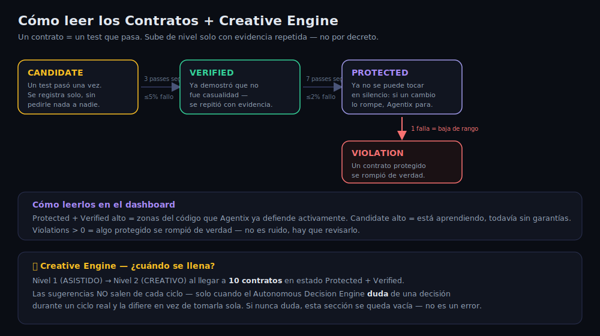

# Cómo leer los Contratos y el Creative Engine

En Preservation Intel del dashboard (`akdd dashboard`) ves 4 números: Protected, Verified,
Candidate, Violations. Esta guía explica qué significa cada uno y cuándo se llena el
Creative Engine, sin tecnicismos.

## Un contrato = un test que pasa

Cada vez que corre `aa:` y los tests pasan, Agentix registra automáticamente cada test como
un "contrato" — una promesa de que ese comportamiento funciona. Ningún contrato nace protegido:
todos empiezan como **Candidate** y solo suben de nivel si se repiten con evidencia real.

## Los 3 niveles (y la caída)

| Estado | Qué significa | Cómo se llega |
|---|---|---|
| **Candidate** | Un test pasó, se registró. Todavía no hay garantía. | Automático, la primera vez que pasa |
| **Verified** | Ya demostró que no fue casualidad. | 3 veces seguidas pasando, con ≤5% de fallos en el historial |
| **Protected** | Zona activamente defendida — si algo la rompe, Agentix para el ciclo. | 7 veces seguidas pasando, con ≤2% de fallos |
| **Violation** | Un contrato Protected se rompió de verdad. | Un contrato Protected falla → baja a "invalidated" y se registra la violación |

**Candidate alto** no es malo — es normal en un proyecto activo, es simplemente lo que
todavía no acumuló suficientes repeticiones. **Violations > 0** sí merece atención: significa
que algo que Agentix ya consideraba "seguro" se rompió de verdad.

## Creative Engine — cuándo pasa de Asistido a Creativo

El Creative Engine tiene 2 niveles:

- **Nivel 1 — ASISTIDO**: el modo por defecto.
- **Nivel 2 — CREATIVO**: se activa automáticamente al llegar a **10 contratos** en estado
  Protected + Verified combinados. Antes de eso, el dashboard te dice "Faltan N contratos
  para Nivel 2".

Las **sugerencias** que aparecen ahí (`creative_suggestions`) no salen de cualquier ciclo —
solo se generan cuando el Autonomous Decision Engine encuentra algo durante un ciclo real y
**duda** lo suficiente como para no decidirlo solo, así que lo difiere para que lo revises tú.
Si el sistema nunca duda (porque siempre está seguro de sus decisiones, o porque nunca se
topa con una decisión ambigua), esa sección se queda vacía indefinidamente — eso no es un
bug ni significa que el sistema no funcione, significa que no ha encontrado nada lo
suficientemente incierto como para preguntarte.
