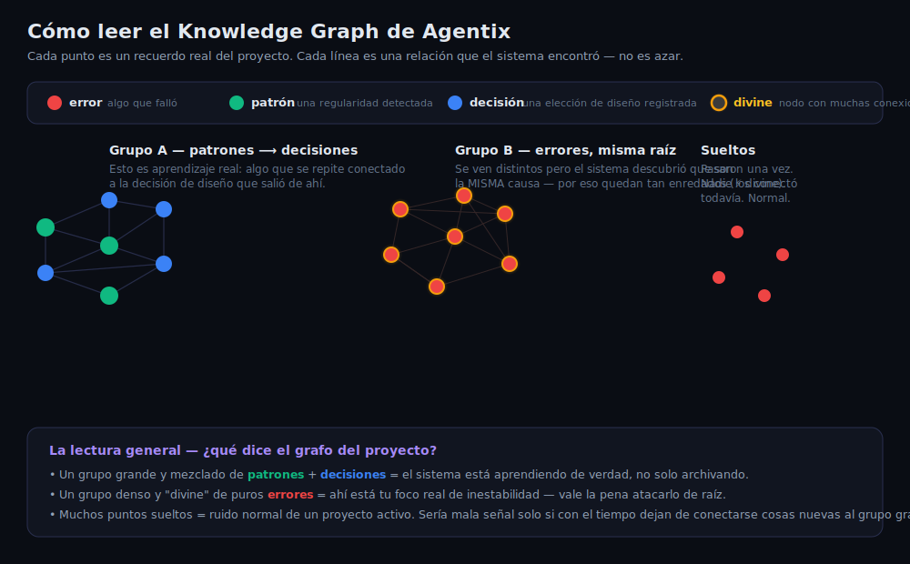

# Cómo leer el Knowledge Graph

El dashboard de Agentix (`akdd dashboard`, `localhost:3847`) no es solo un adorno visual — es la
representación literal de la memoria del proyecto. Esta guía explica qué significa cada cosa que ves
ahí, sin tecnicismos.

## Cómo se navega (3D real)

El grafo se renderiza en 3D — esferas de verdad, no círculos planos — con cámara orbitable:

- **Clic + arrastrar** → orbita la cámara alrededor del grafo.
- **Scroll** → zoom in/out.
- **Clic en un nodo** → lo selecciona y resalta (en amarillo) todas sus conexiones reales; el
  resto del grafo se atenúa para que se note el subgrafo relevante.
- **Reset / Center** (parte inferior) → si te perdiste orbitando, vuelve a encuadrar todo el
  grafo automáticamente.
- El **"?" flotante** (esquina inferior derecha) abre un glosario en lenguaje simple de los
  términos que aparecen en ese grafo específico — útil si no eres quien escribió el código.

Hay tres pestañas, cada una con su propio grafo 3D:

| Pestaña | Qué muestra |
|---|---|
| **KDD Memory** | La memoria de decisiones/errores/patrones que describe el resto de esta guía. |
| **Code Structure** | El mapa real del código (archivos/símbolos e imports entre ellos), sacado del índice AST — no tiene "divine"/error/patrón, tiene sus propios tipos (archivo, clase, función). |
| **Combined** | Fusiona los dos grafos anteriores — las líneas moradas son relaciones reales guardadas; las verdes son una **aproximación por coincidencia de área/ruta**, no un vínculo exacto guardado en la base de datos. |

## El código de colores

| Color | Tipo | Qué es |
|---|---|---|
| 🔴 Rojo | `error` | Algo que falló, capturado automáticamente |
| 🟢 Verde | `patrón` | Una regularidad que el sistema detectó en el código o en los ciclos de trabajo |
| 🔵 Azul | `decisión` | Una elección de diseño/negocio que quedó registrada |
| 🟡 Anillo dorado | `divine` | No es un tipo nuevo — es cualquier nodo con muchas conexiones. El sistema lo resalta porque actúa como un "hub": muchas cosas dependen de él o lo referencian |

## Las líneas importan más que los colores

Una línea entre dos nodos **no es decoración** — es una relación real que Agentix guardó en su base
de datos porque encontró que esos dos recuerdos están conectados (ej: "este error llevó a este
patrón", "este patrón informó esta decisión"). Cuando ves un **grupo de nodos conectados entre sí**,
estás viendo una isla de conocimiento: eventos que el sistema relacionó explícitamente, no una
coincidencia de layout.

## Los tres tipos de grupo que vas a ver

**1. Grupos mixtos de patrones + decisiones (verde + azul)**
El mejor síntoma de salud: el sistema no solo archiva errores, conecta lo que aprendió con las
decisiones de diseño reales que resultaron de ahí. Cuanto más grande y mezclado este grupo, más
"memoria viva" tiene tu proyecto.

**2. Grupos densos de un solo color, casi todos "divine" (normalmente rojo)**
Varios errores que a simple vista parecen distintos, pero que el sistema identificó como **la misma
causa raíz**. Si tienes uno de estos, ahí está tu foco real de inestabilidad — no son 10 problemas
distintos, es 1 problema con 10 síntomas.

**3. Puntos sueltos, sin ninguna línea**
Eventos que pasaron una vez y a los que nadie (ni el sistema, todavía) les encontró relación con
nada más. **Esto es normal** en cualquier proyecto activo — no es un defecto del grafo ni del
sistema. Sería mala señal solo si, sesión tras sesión, dejan de sumarse nodos nuevos al gran grupo
mixto de patrones+decisiones, o si un grupo de errores "divine" sigue creciendo sin que nadie lo
ataque de raíz.

## La lectura de conjunto

El grafo entero es, en el fondo, una respuesta a una sola pregunta: **¿el proyecto está aprendiendo,
o solo está acumulando?** Un grafo sano tiene un núcleo grande y mezclado de patrones→decisiones, uno
o pocos focos de error bien identificados (no diez), y una cola larga de puntos sueltos que no crece
más rápido que el núcleo. Si el núcleo no crece y los puntos sueltos sí, es momento de correr
`aa: aprende` para que el sistema absorba conocimiento que quedó fuera del pipeline.
